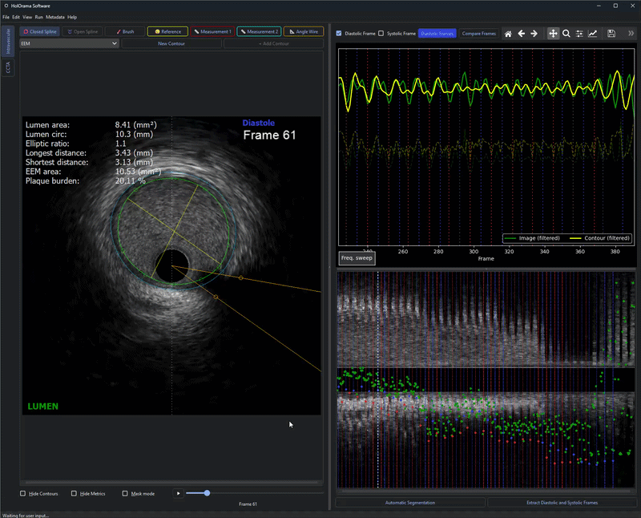
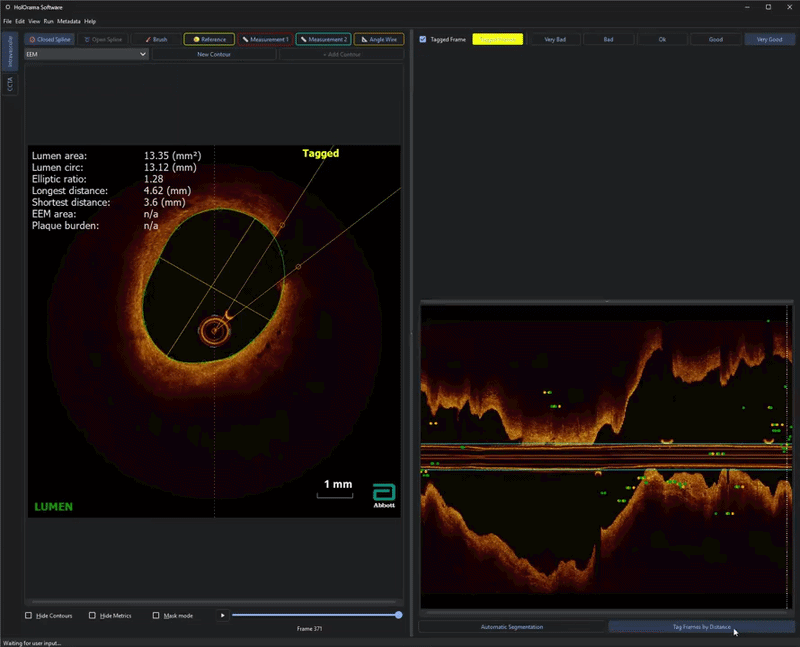
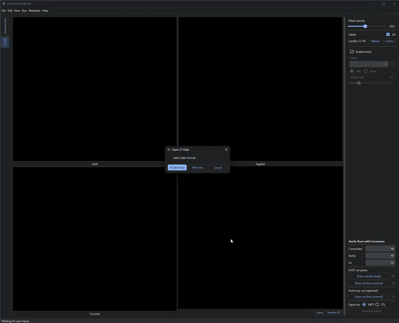

<p align="center">
  <a href="https://github.com/AI-in-Cardiovascular-Medicine/HolOrama.jpg">
    
  </a>
</p>


# HolOrama: A unified platform for cardiac image analysis <!-- omit in toc -->
Currently spans:
- Quantification of Coronary Artery Anomalies
- Quantification of Optical Coherence Tomography
- Quantification of Coronary Computed Tomography Angiography

[](https://github.com/AI-in-Cardiovascular-Medicine/HolOrama/tags)
[](LICENSE)
[](https://HolOrama.readthedocs.io)
[](https://doi.org/10.1016/j.cmpb.2025.109065)

# Demo
<p align="left">
  Segment, modify and analyze IVUS images, inclusive with gating functionalities:<br>
  
</p>

<p align="left">
  Also spans to OCT images, address uncertainty systematically:<br>
  
</p>

<p align="left">
  Segment and visualize CCTA data in 3D, remove outliers with intuitiv tools:<br>
  
</p>

## Table of contents <!-- omit in toc -->

- [Installation](#installation)
- [Basic](#basic)
- [Functionalities](#functionalities)
- [Configuration](#configuration)
- [Usage](#usage)
- [Keyboard shortcuts](#keyboard-shortcuts)
- [Acknowledgements](#acknowledgements)

## Installation

The easiest way to install is via the provided scripts — they handle all platform-specific steps automatically. If you run into problems, follow the step-by-step instructions further below.

### Linux / macOS — script

```bash
bash install.sh
```

The default install is GPU-ready (CUDA 11.8). Optional flags:

| Flag | Effect |
|------|--------|
| `--dev` | Also install dev dependencies |
| `--nnuzoo` | Install nnUZoo from GitHub |
| `--cpu` | Switch to CPU-only torch (no GPU) |
| `--cuda 121` | Switch to CUDA 12.1 build instead of the default cu118 |

### Windows — script

First install the [Visual C++ Redistributable 2022 (x64)](https://aka.ms/vs/17/release/vc_redist.x64.exe) if not already present, then run in PowerShell:

```powershell
.\install.ps1
```

The script automatically applies all Windows-specific fixes (missing OpenMP DLL, `optree` version pin). The default install is GPU-ready (CUDA 11.8). Optional flags:

| Flag | Effect |
|------|--------|
| `-Dev` | Also install dev dependencies |
| `-NnUZoo` | Install nnUZoo from GitHub |
| `-Cpu` | Switch to CPU-only torch (no GPU) |
| `-Cuda 121` | Switch to CUDA 12.1 build instead of the default cu118 |

---

### Step-by-step installation (if the scripts fail)

#### Linux / macOS

```bash
pip install uv
uv sync
source .venv/bin/activate
```

For developers:
```bash
uv sync --group dev
```

For nnUZoo (automatic segmentation):
```bash
uv pip install git+https://github.com/AI-in-Cardiovascular-Medicine/nnUZoo@main
```

For GPU (CUDA 11.8):
```bash
uv pip install --reinstall "torch==2.4.0+cu118" "torchvision==0.19.0+cu118" \
    --index-url https://download.pytorch.org/whl/cu118
```

If you plan on using GPU acceleration, install the required NVIDIA drivers and CUDA toolkit beforehand:
```bash
sudo apt update && sudo apt upgrade
sudo apt install build-essential dkms
sudo ubuntu-drivers autoinstall
sudo reboot
nvidia-smi  # verify driver installation
sudo apt install nvidia-cuda-toolkit
```

#### Windows — step by step

##### 1. Install Visual C++ Redistributable

Download and install the [Visual C++ Redistributable 2022 (x64)](https://aka.ms/vs/17/release/vc_redist.x64.exe) if not already present.

##### 2. Base install

```powershell
pip install uv
uv sync
.\.venv\Scripts\Activate.ps1
```

##### 3. Fix missing LLVM OpenMP runtime (`libomp140.x86_64.dll`)

PyTorch 2.4.0 on Windows depends on `libomp140.x86_64.dll` which is not bundled in the pip wheel. Run this once after installation:

```python
import urllib.request, tarfile, io, os, sys

url = 'https://conda.anaconda.org/conda-forge/win-64/llvm-openmp-14.0.0-h2d74725_0.tar.bz2'
data = urllib.request.urlopen(url).read()
dest = os.path.join(sys.prefix, 'Lib', 'site-packages', 'torch', 'lib', 'libomp140.x86_64.dll')

with tarfile.open(fileobj=io.BytesIO(data), mode='r:bz2') as t:
    f = t.extractfile('Library/bin/libomp.dll')
    with open(dest, 'wb') as out:
        out.write(f.read())
print('Done:', dest)
```

> **Note:** This file will be lost if torch is reinstalled — re-run the script afterwards.

##### 4. Fix `optree` version incompatibility

`optree >= 0.14` is incompatible with `torch 2.4.0` and causes a C-level access violation. Downgrade it:

```bash
uv pip install "optree==0.13.1"
```

##### 5. GPU acceleration (CUDA)

Install the CUDA-enabled torch build matching your driver. With CUDA driver ≤ 12.0 (check with `nvidia-smi`), use the CUDA 11.8 build:

```bash
uv pip install --reinstall "torch==2.4.0+cu118" "torchvision==0.19.0+cu118" \
    --index-url https://download.pytorch.org/whl/cu118
```

After installing the CUDA build, re-run the `libomp140.x86_64.dll` script from step 3.

## Functionalities

This application is designed for IVUS, OCT and CCTA images in DICOM or NIfTi format and offers the following functionalities:

### IVUS / OCT

- Inspect IVUS/OCT images frame-by-frame and display DICOM metadata
- Manually **draw one or several contours** (lumen, eem, calcium, side branch, macrophage, lipid) with automatic calculation of several measurements
- Either draw closed spline, open spline or a closed spline with an uncertain region indicated by start- and end point
- **Automatic segmentation** of (currently only IVUS) lumen for all frames
- **Automatic gating** with extraction of diastolic/systolic frames if in IVUS mode
- Manually tag diastolic/systolic frames
- Ability to measure up to two distances per frame which will be stored in the report
- Indicate the wire shadow using an angle
- Create automatic masks from contour with predefined rulesets
- Copy/paste contours from neighbouring, gated or tagged frames
- **Auto-save** of contours and tags enabled by default with user-definable interval
- Generation of report file containing detailed metrics for each frame
- Save coordinate data as csv files
- Ability to save images and segmentations as **NIfTi files**, e.g. to train a machine learning model

### CCTA

- Read CT volumes from a **DICOM folder** or a **NIfTi file** and view them as synchronized axial, coronal and sagittal slices
- Load an existing segmentation mask (NIfTi) or start from a blank, multi-label mask
- **Brush tool** to manually add or erase mask labels on any of the 2D views, with adjustable radius and per-label color
- **3D volume rendering** of all visible mask labels (surface extraction via VTK)
- **Lasso tool** in the 3D render to draw a closed region and delete the voxels of a chosen label that fall inside it
- Toggle label visibility/color and rename labels, synced across the 2D views, brush tool and 3D render
- Draw cut lines on the axial/coronal views to define the LVOT and aortic root, then extract the coronaries/aorta/LV as a combined **NIfTi mask** or **STL mesh**
- **Auto-save** of the mask enabled by default with user-definable interval, with versioned mask files and auto-reload of the latest mask on reopening a volume

## Configuration

Make sure to quickly check the **src/config.yaml** file and configure everything to your needs.

**Display**:
- image_size: In pixels, creates the quadratic box displaying the IVUS/OCT images. Default 800x800 px.
- gating_display_stretch: input parameter for .setStretchFactor in class RightHalf
- lview_display_stretch: input parameter for .setStretchFactor in class RightHalf
- windowing_sensitivity: How much windowing (level/width) changes per pixel dragged with <kbd>RMB</kbd>. 1 is default, below 1 slower, above 1 faster.
- zoom_sensitivity: Fraction of zoom applied per pixel dragged. Below 0.005 for slower, above for faster.
- n_interactive_points: The draggable points on the contour (lumen); calcium, lipid, macrophage and branch contours default to half of this. New points can also be added interactively by clicking on the contour.
- n_points_contour: Number of points used to represent the interpolated contour outline. Ideally a multiple of 100 (used when calculating closest points).
- contour_thickness / point_thickness / point_radius: Line and knot-point drawing sizes for contours.
- color_contour / color_eem / color_calcium / color_branch / color_start_point / color_end_point / color_angle: Colors used for each contour/marker type. Accepts any of the 20 predefined PyQt colors or a hex code (see [Qt colors](https://doc.qt.io/qt-6/qcolor.html)).
- alpha_contour: Contour fill transparency, 0-255 (higher is more opaque).

**Gating**:
- normalize_step: If step=0, compute one global z-score over the entire data. If step > 0, split data into non-overlapping windows of length normalize_step and apply z-score to each window separately.
- f_cardiac_min / f_cardiac_max: Heart-rate search range in Hz for the cardiac frequency detection, covering rest (~45 BPM) to stress (~200 BPM).
- bandpass_lo_frac: Lower bandpass cutoff as a fraction of the detected cardiac frequency; removes slow pullback trend (sub-cardiac drift).
- bandpass_hi_frac: Upper bandpass cutoff as a fraction of the detected cardiac frequency; passes the 2nd harmonic while removing speckle noise.

**Report**:
- plot: Whether to display a plot of the gated-frame results after report generation.
- save_as_csv: Whether to additionally save contour coordinate data as csv files.

**Save**:
- autosave_interval: Auto-save interval in ms for contours/tags (IVUS/OCT) and the mask (CCTA).
- nifti_dir: Default output directory for images/segmentations exported from `segment_files.py`.
- save_niftis: Which frames to save as NIfTi when exporting — `'contoured'`, `'all'` or `'none'`.
- save_2d: Whether to additionally save each frame's image/mask as an individual NIfTi file.
- save_3d: Whether to save the full stack of frames as a single 3D NIfTi volume.

**Segmentation**:
- model_file: Path to the (nnU-Net) automatic IVUS lumen segmentation model.
- model_fold: Model fold to use for inference.
- normalize: Set to True when using a TensorFlow model that expects normalized input.
- input_dir: Input directory used only by `segment_files.py` for batch segmentation.
- batch_size: Batch size used during inference.
- conserve_memory: Set to True on devices with less than 32 GB RAM; increases inference time but lowers memory use.

## Usage

After the config file is set up properly, you can run the application using:

```bash
python3 src/main.py
```

This will open a graphical user interface (GUI) in which you have access to the above-mentioned functionalities.

## Keyboard shortcuts
For ease-of-use, this application contains several keyboard shortcuts.\
In the current state, these cannot be changed by the user (at least not without changing the source code):

<p align="left">
  <br>
</p>

- Press <kbd>Ctrl</kbd> + <kbd>O</kbd> to open a DICOM/NIfTi file
- Use the <kbd>A</kbd> and <kbd>D</kbd> keys to move through the IVUS images frame-by-frame
- If gated (diastolic/systolic) frames are available, you can move through those using <kbd>S</kbd> and <kbd>W</kbd>\
  Make sure to select which gated frames you want to traverse using the corresponding button (blue for diastolic, red for systolic)
- Press <kbd>E</kbd> to manually draw a new lumen contour\
  In case you accidentally delete a contour, you can use <kbd>Ctrl</kbd> + <kbd>Z</kbd> to undo
- Use <kbd>1</kbd>, <kbd>2</kbd> to draw measurements 1 and 2, respectively
- Drag <kbd>RMB</kbd> left/righ up/down for windowing (can be reset by pressing <kbd>R</kbd>)
- Press <kbd>C</kbd> to toggle color mode
- Press <kbd>H</kbd> to hide all contours
- Press <kbd>J</kbd> to jiggle around the current frame
- Press <kbd>Ctrl</kbd> + <kbd>S</kbd> to manually save contours (auto-save is enabled by default)
- Press <kbd>Ctrl</kbd> + <kbd>R</kbd> to generate report file
- Press <kbd>Ctrl</kbd> + <kbd>Q</kbd> to close the program
- Press <kbd>Alt</kbd> + <kbd>P</kbd> to plot the results for gated frames (difference area systole and diastole, by distance)
- Press <kbd>Alt</kbd> + <kbd>Delete</kbd> to define a range of frames to remove gating
- Press <kbd>Alt</kbd> + <kbd>S</kbd> to define a range of frames to switch systole and diastole in gated frames
- Press <kbd>Esc</kbd> to exit drawing mode and return to a neutral state
- Press <kbd>RMB</kbd> on an existing knot point to remove it
- Scroll <kbd>MW</kbd> to scroll through frames (forward/backward)
- Drag <kbd>LMB</kbd> up/down for zooming (can be reset by pressing <kbd>F</kbd>)
- Drag <kbd>Ctrl</kbd> + <kbd>LMB</kbd> to move the image inside it's widget
- Press <kbd>Ctrl</kbd> + <kbd>MW</kbd> to shrink or expand the currently selected contour (moves all knot points toward/away from their centroid)
- Press <kbd>Q</kbd> to manually draw an ``external elastic membrane`` (EEM) contour
- Press <kbd>Shift</kbd> + <kbd>Q</kbd> to spawn an ``EEM`` contour from an existing ``lumen`` contour (20 % radial expansion from lumen centroid); does nothing if EEM already exists on that frame
- Press <kbd>Shift</kbd> + <kbd>A</kbd> to copy the active contour from the previous frame to the current frame
- Press <kbd>Shift</kbd> + <kbd>D</kbd> to copy the active contour from the next frame to the current frame
- Press <kbd>Shift</kbd> + <kbd>W</kbd> to copy the active contour from the next gated/tagged frame (only works when the current frame is itself gated/tagged)
- Press <kbd>Shift</kbd> + <kbd>S</kbd> to copy the active contour from the previous gated/tagged frame (only works when the current frame is itself gated/tagged)
- Press <kbd>7</kbd> to manually draw a ``calcification`` contour
- Press <kbd>Ctrl</kbd> + <kbd>7</kbd> to draw an additional ``calcification`` contour in the current active spline tool (open or closed)
- Press <kbd>8</kbd> to manually draw a ``side branch`` contour
- Press <kbd>Ctrl</kbd> + <kbd>8</kbd> to draw an additional ``side branch`` contour in the current active spline tool (open or closed)
- Press <kbd>9</kbd> to manually draw a ``lipid`` contour (only open spline)
- Press <kbd>Ctrl</kbd> + <kbd>9</kbd> to draw an additional ``lipid`` contour
- Press <kbd>0</kbd> to manually draw a ``macrophage`` contour (only open spline)
- Press <kbd>Ctrl</kbd> + <kbd>0</kbd> to draw an additional ``macrophage`` contour

# Citation
Please kindly cite the following paper if you use this repository.

```
@article{stark2025automated,
  title={Automated intravascular ultrasound image processing and quantification of coronary artery anomalies: the HolOrama software},
  author={Stark, Anselm W and Kazaj, Pooya Mohammadi and Balzer, Sebastian and Ilic, Marc and Bergamin, Manuel and Kakizaki, Ryota and Giannopoulos, Andreas and Haeberlin, Andreas and R{\"a}ber, Lorenz and Shiri, Isaac and others},
  journal={Computer Methods and Programs in Biomedicine},
  pages={109065},
  year={2025},
  publisher={Elsevier},
  doi={10.1016/j.cmpb.2025.109065},
  url={https://doi.org/10.1016/j.cmpb.2025.109065}
}
```
```
Stark, A. W., Kazaj, P. M., Balzer, S., Ilic, M., Bergamin, M., Kakizaki, R., Giannopoulos A., Haeberlin A., Räber L., Gräni, C. (2025). Automated intravascular ultrasound image processing and quantification of coronary artery anomalies: the HolOrama software. Computer Methods and Programs in Biomedicine, 109065.
```

