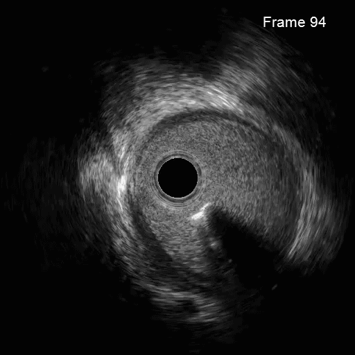
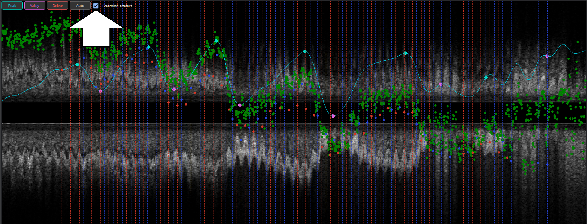
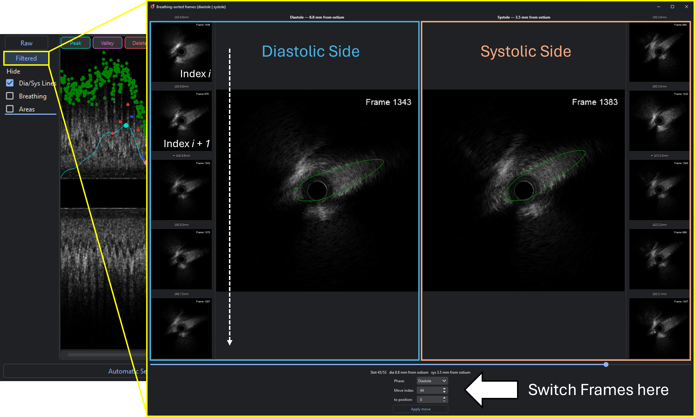

.. docs/contents/modules/breathing.rst

Breathing motion (IVUS)
=======================

*Part of the* :doc:`intravascular` *module, IVUS only.*

There is a second motion artefact which can appear during a pullback. With breathing, the whole
aortic root moves relative to the guiding catheter, which results in much larger movements than
during the cardiac cycle. Pullbacks with large respiratory motion will display wild changes
within the pullback, as in this example:

On the area plot, the breathing artefact appears as a low-frequency oscillation of lumen area,
apart from the labeled systolic and diastolic peaks.

   Longitudinal view after running :doc:`Gating <gating>`. The cyan curve is the extracted
   respiratory envelope, with peaks (maximum displacement) and valleys (rest) marked. However,
   the program does not know whether the oscillation is a real artefact or just noise, so you must 
   declare it with the **Breathing artefact** checkbox.

During a pullback the chest moves. The catheter therefore does not advance along the vessel
at a constant rate: it is alternately held back and pushed forward by respiration, so the
frame number stops being a faithful measure of position. Two frames acquired at the same
distance marker can sit millimetres apart anatomically.

HolOrama detects that respiratory component from the lumen-area signal, lets you decide if it is
a respiratory artefact, review and correct it, and can then **reorder the gated frames into 
a breathing-corrected pullback**.

How it works
------------

1. **Detrend.** A low-order polynomial is fitted to lumen area versus frame number: this is
   the natural taper of the vessel along the pullback. Gated (manually reviewed) frames get
   ten times the weight, so the trend is anchored by reliable points instead of being
   dragged around by ostial noise.
2. **Residual.** ``residual = area − trend``. What remains oscillating is respiration.
3. **Respiratory rate.** Detected as the spectral peak of the residual (or overridden
   manually), then the residual is low-pass filtered at about twice that rate to isolate a
   clean breathing envelope.
4. **Peaks and valleys.** Turning points of that envelope are found with the same
   hysteresis walker used for cardiac gating. **Valleys are rest**, peaks are maximum
   respiratory displacement.
5. **Binning.** Each frame is assigned to one of ``gating.breathing_bins`` displacement
   bins per half-cycle (default 5), where bin 0 is the valley/rest state. Ascending
   (valley → peak) and descending (peak → valley) half-cycles map onto the same bins by
   displacement, so irregular breathing with unequal half-cycle lengths still harmonises.
6. **Registration.** For each bin a line ``area = slope·frame + intercept`` is fitted
   through that bin's own points, and the horizontal shift that makes it agree with the
   valley (rest) line is solved for directly. Shifts are forced to be monotonic in
   magnitude, so the valley bin (fixed at 0) and peak bin anchor the noisier bins in
   between.
7. **Corrected order.** Each frame gets a corrected position; sorting by it produces the
   breathing-corrected order used by the *Filtered* view.

The result also yields a corrected pullback length: once every bin has been shifted
independently, raw frame count no longer measures distance, so the span of one full
valley → peak half-cycle plus the peak shift is reported as the true length.

Tutorial
--------

Prerequisites
~~~~~~~~~~~~~

- An IVUS pullback with lumen contours: the breathing signal is derived from lumen area,
  and at least 30 contoured frames are needed before the curve is drawn at all.
- :doc:`Gating <gating>` has been run, if you want to use the breathing-corrected sort
  (which reorders *gated* frames).

1. Look at the breathing curve
~~~~~~~~~~~~~~~~~~~~~~~~~~~~~~

The curve is overlaid on the **longitudinal view** in the lower right of the window,
together with the lumen-area dots:

- **Cyan curve**: the extracted respiratory envelope.
- **Cyan markers**: peaks (maximum displacement).
- **Magenta markers**: valleys (rest).

If the oscillation is small relative to the vessel calibre, no markers are drawn: there is
nothing to correct.

Use the *Hide* checkboxes to the left of the longitudinal view to declutter: *Breathing*
clears the curve and its markers, *Areas* clears the area dots, *Dia/Sys Lines* clears the
phase markers.

2. Correct the peaks and valleys
~~~~~~~~~~~~~~~~~~~~~~~~~~~~~~~~

Four small buttons sit on the longitudinal view:

.. list-table::
   :header-rows: 1
   :widths: 20 80

   * - Button
     - Effect
   * - **Peak**
     - Click in the view to add a peak marker.
   * - **Valley**
     - Click in the view to add a valley marker.
   * - **Delete**
     - Click a marker to remove it.
   * - **Auto**
     - Discard all manual edits and return to the automatic detection.

The three mode buttons are mutually exclusive. As soon as you make the first manual edit,
the marker set becomes fully manual, seeded from the automatic guess, so nothing is lost,
but every marker is now deletable.

3. Declare whether there is an artefact at all
~~~~~~~~~~~~~~~~~~~~~~~~~~~~~~~~~~~~~~~~~~~~~~

The **Breathing artefact** checkbox next to those buttons is the switch that decides what
*Filtered* actually does:

- **Checked (default)**: the pullback has a respiratory artefact. The curve is drawn
  solid, and the *Filtered* view applies the breathing correction.
- **Unchecked**: no meaningful artefact. The curve is drawn dotted, and *Filtered* only
  lets you shuffle frames by hand, applying no correction.

Uncheck it when the curve is clearly noise. Forcing a correction onto a pullback without a
real respiratory component only adds error.

4. Review the corrected order
~~~~~~~~~~~~~~~~~~~~~~~~~~~~~

Click **Filtered** (left of the longitudinal view) to open the breathing-sorted viewer. It
runs the registration independently for the gated diastolic and gated systolic frames and
shows them side by side:

- A central slider scrolls through the **breathing-corrected order**, not acquisition
  order.
- Diastole and systole are shown with their lumen contours, each flanked by a five-image
  filmstrip of its neighbours in sorted order, labelled with index and distance from the
  ostium.
- Only gated frames appear; positions without a frame are skipped.

Look for a frame whose contour is obviously out of sequence with its neighbours; that is
what the manual swap is for.

5. Fix individual outliers
~~~~~~~~~~~~~~~~~~~~~~~~~~

At the bottom of the viewer, choose the phase (**Diastole** / **Systole**), enter the two
indices to exchange, and click **Apply move**. The swap is stored immediately.
This sorting can of course also be performed when no breathing artefact is present, but the
patient maybe moved, or other influences resulted in a shift in frames.

Click **Raw** to go back to acquisition order at any time. The sort (peaks, valleys,
ordered indices, per-bin shifts and every manual move) is cached with the case and written
into the contour JSON, so it survives closing and reopening. When the gated frame set
changes, membership is reconciled rather than recomputed from scratch.

   Example when opening the filtered view. On the left side are all diastolic frames,
   the frames are sorted top to bottom, with the more proximal ones being at the bottom.
   The slider below shows the diastolic and systolic frames registered by the most proximal
   frame (here the ostium). Below frames can be switched by index, the current index is
   always corresponding to the currently displayed frame.

6. Export
~~~~~~~~~

Saving a report always writes ``combined_sorted_manual.csv`` next to the other CSVs: the
gated diastolic frames followed by the systolic frames, carrying the manual sort. See
:doc:`../outputs`.

Tuning
------

.. list-table::
   :header-rows: 1
   :widths: 30 70

   * - Setting
     - Effect
   * - ``gating.breathing_bins``
     - Bins per breathing half-cycle (default 5). More bins resolve the displacement more
       finely but leave fewer points per bin, which makes the per-bin line fit noisier.
   * - **Breathing sweep** (gating plot)
     - Heat map of the signal filtered at increasing breathing-rate cutoffs; click a row to
       override the detected respiratory rate when the automatic estimate is wrong.

Troubleshooting
---------------

.. list-table::
   :header-rows: 1
   :widths: 38 62

   * - Symptom
     - What to try
   * - No breathing curve is drawn
     - Fewer than 30 contoured frames, or the oscillation is under 5 % of the maximum
       area: there is nothing to correct.
   * - The curve follows the vessel taper rather than respiration
     - The polynomial trend did not capture the taper. Contour more frames, especially
       gated ones, since they carry ten times the weight.
   * - Markers alternate implausibly fast
     - Override the respiratory rate via **Breathing sweep**, or place peaks and valleys by
       hand with the **Peak** / **Valley** buttons.
   * - *Filtered* changes nothing
     - **Breathing artefact** is unchecked, or gating has not been run: the sort operates
       on gated frames.
