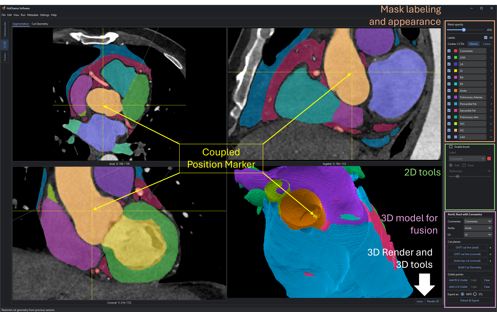
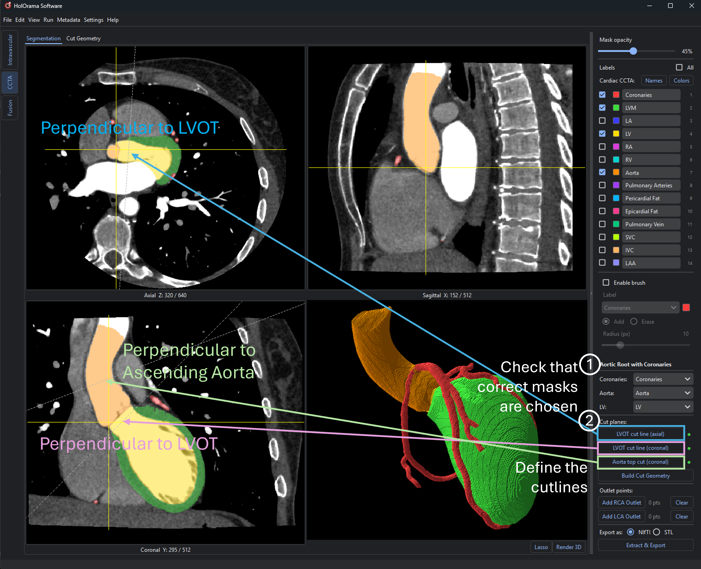
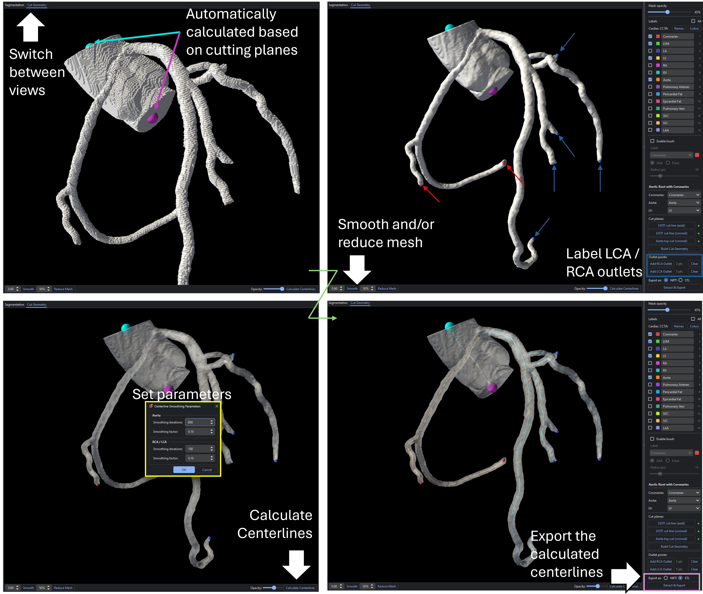

.. docs/contents/modules/ccta.rst

CCTA
====

The CCTA module works on a coronary CT angiography volume: correct or create a multi-label
segmentation, clean it up in 3D, and cut out the aortic root together with the coronaries
as a single model: the geometry the :doc:`fusion` module later merges with an
intravascular pullback.

The layout
----------

The module has two tabs on the left and one control column on the right.

.. rubric:: Tab "Segmentation"

A 2×2 grid: **Axial**, **Sagittal**, **Coronal** slice views and a **3D** view. The slice
views share one cursor, so clicking in one moves the other two to the same voxel.

.. rubric:: Tab "Cut Geometry"

A dedicated 3D view for the cut model, with its own render window and picking. Toolbar
along the bottom: **Smooth** (+ Taubin lambda), **Reduce Mesh** (+ target reduction),
**Opacity**, **Calculate Centerlines**.

.. rubric:: Right column

- **Mask opacity** slider.
- **Labels**: one row per label with a visibility checkbox, a colour swatch, an editable
  name and the numeric label value, plus an *All* toggle and the *Cardiac CCTA*
  **Names** / **Colors** preset buttons.
- **Brush** controls: *Enable brush*, label selector, *Add* / *Erase*, radius.
- **Aortic Root with Coronaries**: mask selectors, cut-plane buttons,
  **Build Cut Geometry**, outlet points, export format and **Extract && Export**.

   Overview over the CCTA module with
   the 2x2 grid and a marker that is synchronized between 2d and 3D view (clickable in all).
   The 3D tools are directly available below the 3D view. The other tools and functionalities
   can be found in the column on the right side. They can be roughly split into labeling, and
   appearance on top, 2D segmentation tools and on the bottom the specific 3D geometry
   preparation, which is needed by the fusion module.

Tutorial
--------

1. Load a volume
~~~~~~~~~~~~~~~~

**File → Open CCTA Folder/File** (:kbd:`Ctrl+Shift+O`), then choose **DICOM Folder** or
**NIfTI File**. The volume is read behind a progress dialog and shown in all four views.

HolOrama then looks for a previously saved mask for this case
(``<case>_ccta_seg_*.nii.gz``) and loads the most recent one automatically, along with any
saved cut state (cut lines, label choices, outlet points and label names), rebuilding the
cut geometry from them. Re-opening a case picks up where you left off.

If no mask is found for a NIfTI volume, you are asked whether you want to load one. You can
also load one at any time with **File → Open CCTA Mask**. Without a mask you start from a
blank multi-label mask, ready to paint.

2. Navigate and window
~~~~~~~~~~~~~~~~~~~~~~

- Click in any slice view to move the shared cursor; the other two views follow.
- Drag :kbd:`RMB` for windowing (:kbd:`R` resets), drag :kbd:`LMB` to zoom (:kbd:`F`
  resets).
- :kbd:`Esc` returns to a neutral state (leaves brush/line-drawing modes).
- :kbd:`Ctrl+Z` undoes the last mask edit, brush strokes and 3D lasso erases alike.

3. Organise the labels
~~~~~~~~~~~~~~~~~~~~~~

In the **Labels** list you can hide or show each label, rename it, and toggle all at once.
The **Cardiac CCTA** presets fill in standard anatomic **Names** and **Colors** in one
click. Names and colours propagate everywhere immediately: the slice overlays, the brush
selector, the 3D render and the cut-geometry dropdowns.

Use the **Mask opacity** slider to check a border against the underlying CT.

4. Edit the segmentation with the brush
~~~~~~~~~~~~~~~~~~~~~~~~~~~~~~~~~~~~~~~

Tick **Enable brush**, choose the target label, choose **Add** or **Erase**, and set the
radius. Then paint in any of the three slice views.

- **Add** writes the selected label into the mask.
- **Erase** clears voxels back to background, regardless of which label they held.
- The cursor shows the brush footprint at the current radius.
- :kbd:`Ctrl+Z` undoes the last stroke.

This is the tool for local corrections: closing a gap in a vessel, trimming a leak into an
adjacent structure, or painting a label from scratch on a blank mask.

5. Render in 3D and remove structures with the lasso
~~~~~~~~~~~~~~~~~~~~~~~~~~~~~~~~~~~~~~~~~~~~~~~~~~~~~

Click **Render 3D** in the 3D view. A surface is extracted for every *visible* label, so
hiding labels first is the quickest way to isolate what you want to look at. Rotate with
:kbd:`LMB`, zoom with the wheel.

To delete a structure:

#. Click **Lasso** (it changes to *Cancel Lasso*).
#. Click around the region to draw a closed polygon on screen.
#. **Right-click** to close and apply it.
#. If more than one label is visible, choose which one to erase from inside the lasso.

Every voxel of that label whose projection falls inside the polygon is removed: the fast
way to strip veins, ribs, noise or a mis-segmented neighbour that would otherwise have to be
erased slice by slice. The erase respects the current camera, so rotate to a view where the
unwanted structure does not overlap what you want to keep. :kbd:`Ctrl+Z` undoes it.

Re-render after edits to see the updated surface.

6. Define the cut planes
~~~~~~~~~~~~~~~~~~~~~~~~

The combined model is defined by three cut lines, drawn in the **Aortic Root with
Coronaries** panel. Pick the source labels first (**Coronaries**, **Aorta**, **LV**), then
draw each line by clicking its button and drawing in the named view:

.. list-table::
   :header-rows: 1
   :widths: 34 66

   * - Button
     - Draw in
   * - **LVOT cut line (axial)**
     - the axial view, where the left ventricular outflow tract is cut off
   * - **LVOT cut line (coronal)**
     - the coronal view, the second line defining the same LVOT plane
   * - **Aorta top cut (coronal)**
     - the coronal view, where the ascending aorta is truncated

The status circle next to each button turns green once that line is drawn. All three are
required: the aorta-top plane is where the outlet centroid is measured, so without it there
is no outlet for the model or for the centerline computation.

   Example on how to set the different cutting planes. First check that the correct contours
   are used. Then define a line perpendicular to the LVOT for the axial view and one for the
   coronal view. Optionaly also the ascending aorta can be cut in the same way.

7. Build the cut geometry
~~~~~~~~~~~~~~~~~~~~~~~~~

Click **Build Cut Geometry**. The coronaries, aorta and LV labels are combined, cut at both
planes, and turned into a surface mesh with inlet and outlet markers located automatically.
The view switches to the **Cut Geometry** tab showing the result.

In that tab:

- **Smooth**: Taubin smoothing at the given lambda (default 0.6), after which the inlet
  and outlet are re-located. Run it more than once for a stronger effect.
- **Reduce Mesh**: decimate to the given target reduction (default 50 %). Fewer faces make
  centerline computation dramatically faster at some cost in detail.
- **Opacity**: fade the surface to see the markers inside it.

8. Optional: compute centerlines
~~~~~~~~~~~~~~~~~~~~~~~~~~~~~~~~~

Centerlines are computed with `vmtk <https://vmtk.github.io>`_, which you install yourself;
see :ref:`install-vmtk`. Everything up to this point works without it.

#. Place the outlet points. Click **Add RCA Outlet**, then click on the cut geometry at the
   distal end of the right coronary artery. Do the same with **Add LCA Outlet** for the
   left. At least one point each is required; the counter next to each button shows how
   many you have placed, and **Clear** removes them. The two modes are mutually exclusive.
#. Click **Calculate Centerlines**. A dialog asks for the smoothing parameters, separately
   for the **Aorta** (default 300 iterations, factor 0.1) and the **RCA / LCA** (default
   100 iterations, factor 0.1); the aorta usually needs considerably heavier smoothing
   than the finer coronary branches.
#. vmtk then runs, per vessel, ``vmtkcenterlines`` → ``vmtkcenterlinesmoothing`` →
   ``vmtksurfacewriter``. This takes minutes; the Voronoi-diagram step is slow and often
   silent, so the progress dialog streams vmtk's output live and prints a heartbeat while a
   step produces none.
#. When it finishes, the centerlines are drawn in the cut-geometry view so you can inspect
   them before trusting them.

Output, written next to the case file:

- ``<case>_root_smooth.stl``: the exact mesh that was fed to vmtk
- ``ao_cl.vtp``, ``rca_cl.vtp``, ``lca_cl.vtp``: the three centerlines
- ``ao.csv``, ``rca.csv``, ``lca.csv``: the source/target points that were used

Those ``.vtp`` files and the STL are exactly what the :doc:`fusion` module asks for.

.. note::
   HolOrama verifies before starting that both vmtk activation scripts exist, that WSL
   starts, and that all three vmtk executables resolve. A failed check produces a specific
   error message rather than a silent failure.

9. Export
~~~~~~~~~

Choose **NIfTI** or **STL** under *Export as*, then click **Extract && Export**.

- **NIfTI** always re-derives the combined voxel mask from the current labels and cut
  planes.
- **STL** exports the mesh currently in the Cut Geometry tab if one has been built, so
  smoothing and decimation are preserved. Smoothing never touches the voxel mask, so it
  cannot be represented in the NIfTI export.

   Demonstration of the full workflow after creating the cut geometry. Inlet and outlet
   of the aorta are automatically caculated based on the cut plane, double check that 
   they look reasonable otherwise adjust the planes. Then smooth and/or reduce the 
   geometry, and label every outlet of the RCA and the LCA. If vmtk was installed, a centerline
   can be calculated, smoothing factor and iterations can be set seperately for aorta and coronaries
   since the aorta centerline otherwise tends to bend at the height of either LCA or RCA ostium.

Saving and auto-save
--------------------

- **File → Save** (:kbd:`Ctrl+S`) while the CCTA module is active writes the mask to
  ``<case>_ccta_seg_<version>.nii.gz``.
- Auto-save runs on the interval configured in ``save.autosave_interval`` (10 s by default)
  and writes both the mask and the cut state whenever either has changed. The mask is
  written on a background thread, so painting is not interrupted.
- Mask files carry the application version, and the most recent one is auto-loaded when the
  case is reopened.

Troubleshooting
---------------

.. list-table::
   :header-rows: 1
   :widths: 40 60

   * - Symptom
     - What to try
   * - **Build Cut Geometry** and **Extract && Export** stay greyed out
     - All three cut lines must be drawn and all three mask selectors must have a label.
   * - The lasso removes more than intended
     - The erase is a projection along the current view direction. Rotate so the unwanted
       structure does not overlap what you want to keep, then :kbd:`Ctrl+Z` and retry.
   * - **Calculate Centerlines** reports vmtk not found
     - Check ``vmtk.venv_path``, ``vmtk.build_path`` and ``vmtk.wsl_distro`` in
       ``config.yaml``; see :ref:`install-vmtk`. The message names the failing check.
   * - Centerline computation takes very long
     - Run **Reduce Mesh** first. Decimating the surface is the single most effective
       speed-up.
   * - Nothing appears after **Render 3D**
     - All labels are hidden, or the mask is empty. Check the *All* toggle in the Labels
       list.
