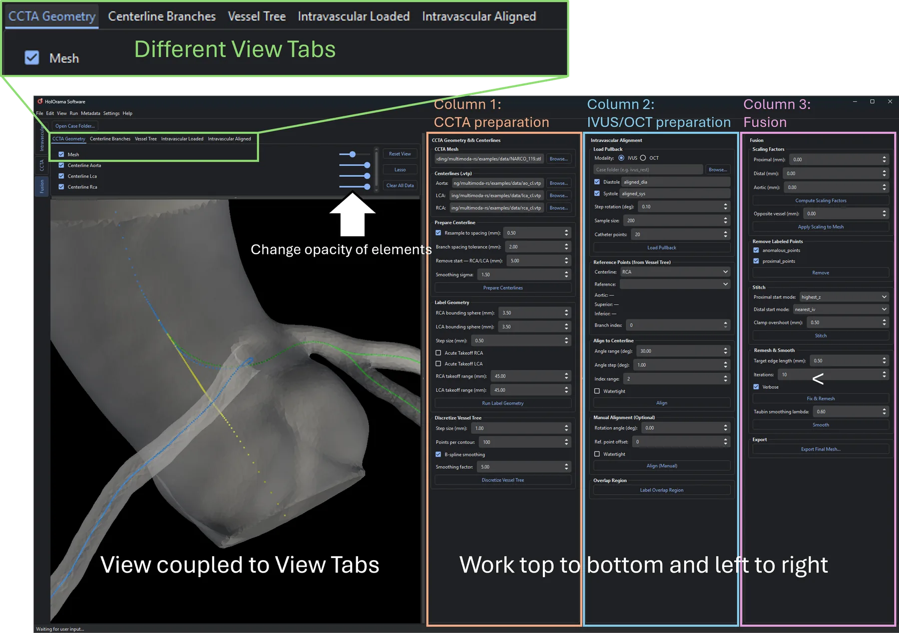
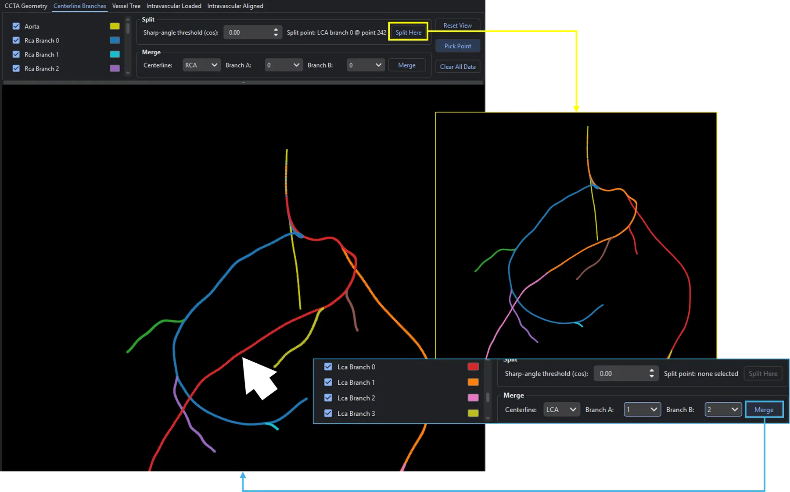

.. docs/contents/modules/fusion.rst

Fusion
======

The fusion module merges a CCTA model and an intravascular pullback into **one geometry**:
the CCTA supplies the course of the vessel through space, the IVUS/OCT pullback supplies
the true lumen cross-section, and the result carries both.

It is a graphical front end for the `multimodars <https://pypi.org/project/multimodars>`_
package :ref:`Stark et al. 2026 <fusion-citation-1>`; every button corresponds to a step of that pipeline, with the intermediate result
rendered in 3D so you can check it before continuing. So if you like the functionality of
this module please also consider leaving a star on the 
`multimodars GitHub <https://github.com/yungselm/multimoda-rs>`_ 👉👈.

If you want to understand in detail how ``multimodars`` works, I would highly recommend you
to additionally checkout it's `documentation <https://multimoda-rs.readthedocs.io/en/latest/>`_.  

.. note::

   Many of the functionalities are generally harder for coronary artery anomalies, hence
   a big focus is directed toward solving the problem for these anomalies. If there are generally
   different workflows for coronary artery disease or other pathologies, it will be highlighted
   with a note field. For example data need to be prepared differently regarding the reference
   points:

   .. figure:: ../../media/dataprep.webp
    :name: fig-fusion-dataprep
    :alt: Data preparation for fusion
    :align: center
    :width: 600px

    For coronary artery anomalies, typically the most reliable landmark for reference points, 
    is the section between the coronary and the aortic wall right at the ostium. Set on point for
    systole and diastole to register them towards each other.
    For coronary artery disease, the pullback doesn't necessarly span the ostium, hence find
    a sidebranch which is visible in the pullback.
    This is necessary because the fusion module automatically detects reference points at the 
    ostium and for every sidebranch, so pullbacks can easily be aligned to the CCTA geometry.

The layout
----------

.. rubric:: Left: the 3D viewer

One VTK view, with a tab per scene. Each tab has its own toolbar listing that scene's
layers with a visibility checkbox and a colour swatch, plus **Reset View**, **Pick Point**
and **Clear All Data**.

.. list-table::
   :header-rows: 1
   :widths: 30 70

   * - Scene
     - Shows
   * - **CCTA Geometry**
     - The CCTA mesh with one coloured point cloud per labelled region, the three
       centerlines, and later the stitched and final meshes.
   * - **Centerline Branches**
     - The RCA and LCA coloured per branch, with numbered sharp-angle markers.
   * - **Intravascular Loaded**
     - The pullback straight after loading, before any centerline alignment.
   * - **Intravascular Aligned**
     - The pullback after alignment, with the resampled centerline and the CCTA mesh
       overlaid for comparison.
   * - **Vessel Tree**
     - The discretised vessel tree with its reference-point triplets.

.. rubric:: Right: three columns

Read left to right; each column is one stage of the pipeline.

#. **CCTA Geometry & Centerlines**: load and prepare the CCTA inputs.
#. **Intravascular Alignment**: load the pullback and align it onto a coronary.
#. **Fusion**: scale, stitch, remesh, export.

.. figure:: https://raw.githubusercontent.com/AI-in-Cardiovascular-Medicine/HolOrama/main/media/Fusion_demo.gif
   :name: fig-fusion-demo
   :alt: Fusing CCTA and intravascular data in HolOrama
   :align: center
   :width: 760px

   Demonstration of the fusion module, and how a workflow is performed from the top of the left column all the way to
   the bottom of the right column. Here, the workflow is performed for a coronary artery anomaly, however the same
   thing applies for coronary artery disease or any other pathology.

   Overview over the Fusion module with the different view tabs highlighted in green. The viewer is
   then coupled to the tab, not all calculated elements are displayed in the same scene. The logic
   is split in three columns which represent CCTA preparation, IVUS/OCT preparation and final the fusion.
   The detailed functionalities can be found below.

What you need before starting
-----------------------------

.. list-table::
   :header-rows: 1
   :widths: 30 70

   * - Input
     - Where it comes from
   * - CCTA mesh (``.stl``, ``.obj``, ``.ply``)

     - :doc:`ccta` → **Build Cut Geometry** → **Extract & Export** as STL, or
       ``<case>_root_smooth.stl``
   * - Three centerlines (``.vtp``): aorta, RCA, LCA
     - :doc:`ccta` → **Calculate Centerlines** (``ao_cl.vtp``, ``rca_cl.vtp``,
       ``lca_cl.vtp``), or any vmtk run of your own
   * - Intravascular contour CSVs
     - :doc:`intravascular` → **File → Save Report** with ``report.save_as_csv: True``,
       which writes ``<case>_csv_files/``

**Open Case Folder…** at the top of the page sets the folder the file pickers start in. It
does not load anything by itself.

Tutorial
--------

Stage 1: CCTA geometry and centerlines
~~~~~~~~~~~~~~~~~~~~~~~~~~~~~~~~~~~~~~~

**1. Load the files.** Browse for the **CCTA Mesh** and for the **Aorta**, **LCA** and
**RCA** centerlines. Everything appears immediately in the *CCTA Geometry* tab as a raw preview,
before anything has been computed: a quick check that you picked the right files and that
they share a coordinate system.

**2. Prepare the centerlines.** Set the parameters, then click **Prepare Centerlines**.

.. list-table::
   :header-rows: 1
   :widths: 38 62

   * - Parameter
     - Meaning
   * - *Resample to spacing (mm)*
     - Resample all three centerlines to a uniform point spacing (default 0.5 mm).
   * - *Branch spacing tolerance (mm)*
     - How far apart consecutive points may be before a new branch is started
       (default 2.0). Duplicated points are removed in any case.
   * - *Remove start, RCA/LCA (mm)*
     - Trim this much off the coronary inlet (default 5.0). Never applied to the aorta,
       which has no such inlet, this is needed for the rolling sphere algorithm, so
       the sphere doesn't intersect with the aorta.
   * - *Smoothing sigma*
     - Gaussian smoothing of the centerline path (default 1.5).

The aorta is prepared first, then the RCA and LCA are oriented to it. Orientation matters
later: point index 0 of a coronary is always its proximal, ostial end. The view switches to
*Centerline Branches*.

**3. Fix the branch structure** *(optional)*. vmtk output rarely matches the anatomic branch
structure exactly. In the *Centerline Branches* tab, RCA and LCA are coloured per branch and
sharp bends are marked with numbered dots, hints for where a split probably belongs.

- **Split:** click **Pick Point**, click anywhere along a branch (not only on a numbered
  marker), then **Split Here**. The *Sharp-angle threshold (cos)* spinbox controls how many
  markers are shown; the status bar reports the count, since a threshold nudge can be
  invisible in the colours.
- **Merge:** choose the *Centerline*, *Branch A* and *Branch B*, then **Merge**.
  Branches can be identified by their color which is displayed, next to the hide buttons.

Branch ids are reassigned after every edit (by descending length), so the scene is rebuilt
each time; your layer visibility is preserved.

   Use ``Pick Point`` and then click on the centerline you want to split. You can then merge
   any two new branches, here the original two split branches, which will always result in 
   deterministic branch ids, since they are based on length.

**4. Label the geometry.** Click **Run Label Geometry**. Each surface point of the mesh is
assigned to a region (aorta, RCA, LCA, branches), and the result is drawn as one coloured
point cloud per region.

.. note::
  This is the first time where the inherent challenges of anomalous coronary arteries are
  uncovered. Therefore several functionalities are mainly developed to overcome the complications
  of anomalies. 

.. list-table::
   :header-rows: 1
   :widths: 38 62

   * - Parameter
     - Meaning
   * - *RCA / LCA bounding sphere (mm)*
     - Radius around the centerline within which surface points are attributed to that
       vessel (default 3.5).
   * - *Step size (mm)*
     - Spacing at which the centerline is walked while labelling (default 0.5).
   * - *Acute Takeoff RCA / LCA*
     - Mark a vessel with an acute (anomalous) take-off. This also drives the anomalous
       wall handling during alignment in column 2; there is no separate toggle there.
   * - *RCA / LCA takeoff range (mm)*
     - Length of the proximal segment treated as the take-off region (default 45).

The branch structure is projected onto the labelled points automatically, and again after
every split or merge.

*Correcting a mislabelled region:* click **Lasso** in the *CCTA Geometry* toolbar, draw a
closed lasso around the offending points, and choose which region they come from and which
they should become. This moves points between regions, for example from ``rca_points`` to
``aorta_points``, without touching the mesh.

.. note::

   This is the first major difference between coronary artery anomalies and other pathologies.
   In the case of coronary artery anomalies, the rolling sphere algorithm for labelling the 
   geometry leads to mislabelling of points since coronary and aorta are so close together:

   .. figure:: ../../media/rolling_sphere.webp
    :name: fig-fusion-rolling-sphere
    :alt: Rolling sphere mislabelling
    :align: center
    :width: 450px
  
    The programm automatically tries to clean this up by ray casting between the aortic centerline
    and the coronary centerline. The logic here is if a ray touches three surfaces the first one
    must be the aortic wall:

   .. figure:: ../../media/ray_casting.webp
    :name: fig-fusion-ray-casting
    :alt: Ray casting reassignment of mislabelled points
    :align: center
    :width: 450px

    However depending on the geometry, still needs some manual adjustments.

**5. Discretise the vessel tree.** Click **Discretize Vessel Tree**. The labelled surface is
converted into stacked contours along each vessel, giving the reference points used for
alignment.

- *Step size (mm)*: spacing between contours (default 1.0).
- *Points per contour*: resolution of each contour (default 100).
- *B-spline smoothing* and *Smoothing factor*: optional smoothing of the contour stack.

The view switches to *Vessel Tree*. Its **RCA reference** and **LCA reference** dropdowns
list the ostium and each side branch; selecting one highlights its triplet of reference
points in the scene. You can also click a marker directly. The same list appears in
column 2; the two stay in sync.

.. warning::
  This will be overworked in the future, so don't be alarmed if results seems chaotic. The
  only thing required from here is a rough triplet for the region of interest. If discretized
  vessel tree does not have a high quality and the triplet is suboptimal, the fixing can still
  be done by doing finetuning with the manual alignment.

Stage 2: intravascular alignment
~~~~~~~~~~~~~~~~~~~~~~~~~~~~~~~~~

**6. Load the pullback.** Choose the modality and browse to the case folder (the
``*_csv_files`` folder written by the report export).

- **IVUS**: tick *Diastole*, *Systole*, or both. With both, a diastole/systole pair is
  loaded; with one, only that phase. Each has its own label field (defaults ``aligned_dia``
  and ``aligned_sys``).
- **OCT**: a single label field (default ``tagged``); the exported tagged-frame arrays
  ``tagged_contours.csv`` and ``tagged_reference_points.csv`` are read.

Three parameters control how the frames are aligned *to each other* inside the pullback:

- *Step rotation (deg)*: rotation step of the coarse search (default 0.1). Finer is more
  precise and slower.
- *Sample size*: points each frame is downsampled to before alignment (default 200).
- *Catheter points*: points on the synthetic catheter contour (default 20).

Click **Load Pullback**. The lofted lumen and wall meshes appear in *Intravascular Loaded*,
diastole and systole in different colours. Check them here: if the final result later looks
wrong, this tab tells you whether it was already wrong before centerline alignment.

.. note:: 
  For more details on how the algorithm uses the input parameters to align the frames,
  checkout `multimodars Intrvascular Tutorial <https://multimoda-rs.readthedocs.io/en/latest/tutorial_intravascular.html>`_.
  However, leaving the default settings should work for almost all cases.

**7. Choose the reference.** In *Reference Points (from Vessel Tree)* pick the
**Centerline** (RCA or LCA) the pullback belongs to, then the **Reference**: the ostium or
one of the side branches. The three reference points (aortic, superior, inferior) are shown
as coordinates. *Branch index* selects which branch of that centerline to align onto;
alignment needs a single-branch centerline.

**8. Align.** Click **Align**.

- *Angle range (deg)*: total rotation search range (default 30).
- *Angle step (deg)*: step of that search (default 1.0).
- *Index range*: how many centerline indices around each reference point are considered
  (default 2).
- *Watertight*: close the lofted geometry.

The result appears in *Intravascular Aligned*: the aligned pullback, the resampled
centerline, and the CCTA mesh overlaid so you can judge the fit directly.

*Manual alignment (optional).* For elliptic, anomalous vessels the automatic search can
land on the wrong rotation. The **Manual Alignment** group rotates by an explicit angle
around a single reference point instead. The field is pre-filled with whatever angle the
last alignment produced, so you can nudge from there. *Ref. point offset* walks along the
centerline: 0 is the point closest to the selected reference, negative walks toward the
ostium (index 0), positive away from it, clamped at both ends.
This is also the preferred technique when the discretization tree (which is based on the
CCTA) cut-off one frame to much from the ostium.

**9. Label the overlap region.** Click **Label Overlap Region**. The coronary the pullback
was aligned onto is partitioned into proximal, overlap and distal sub-regions: the
partition the next stage needs to know which part of the CCTA to replace and which to keep.
It always follows the *Centerline* selector above, so it describes the vessel you actually
aligned.

Stage 3: fusion
~~~~~~~~~~~~~~~~

**10. Scale the CCTA to the intravascular calibre.** Click **Compute Scaling Factors**. The
proximal, distal and aortic values are filled in and remain editable: they are a starting
point, not a verdict.

*Opposite vessel (mm)* is never computed: there is no pullback for the other coronary. Set
it by hand if that vessel also needs scaling, or leave it at 0 to skip it entirely.

Click **Apply Scaling to Mesh**. The distal, aortic, proximal and, if non-zero,
opposite-vessel regions are morphed along their centerlines in that order.

**11. Remove the overlapping points.** In *Remove Labeled Points*, tick which regions to
drop (``overlap_points`` and ``proximal_points`` by default) and click **Remove**. These
are the CCTA points the intravascular geometry replaces; leaving them in would put two
surfaces in the same place.

**12. Stitch.** Click **Stitch**. The intravascular geometry and the CCTA mesh are joined
into one surface.

- *Proximal start mode* / *Distal start mode*: ``nearest_iv`` or ``highest_z``, deciding
  which point of the cut the stitch starts from. ``highest_z`` is the default for the
  proximal end and the right choice for anomalous-RCA cases, where removing the intramural
  segment leaves the proximal ring needing to seat against the highest point of the aortic
  cut.
- *Clamp overshoot (mm)*: tolerance for overshooting rings (default 0.5).

The stitched mesh is shown on its own in *CCTA Geometry*.

**13. Remesh and smooth.** Click **Fix & Remesh**: target edge length (default 0.5 mm)
and iterations (default 10). This repairs the seam and produces an even triangulation; it
runs in the background with live progress output. Then **Smooth** applies Taubin smoothing
at the chosen lambda (default 0.6). Both can be repeated.

**14. Export.** **Export Final Mesh…** writes the result as STL.

Practical notes
---------------

- **Order matters.** Each step checks its prerequisites and tells you exactly what is
  missing ("Prepare centerlines first", "Align the intravascular geometry first"). Working
  through the columns left to right satisfies them in order.
- **Check every stage in the viewer.** The tabs exist so a bad result can be traced to the
  step that produced it, rather than only being noticed at the end.
  This means that you can also explore the module by using trial and error with the visual
  feedback to get the desired results.
- **Clear All Data** (in any scene toolbar) discards every loaded and computed result and
  empties the viewer. It asks for confirmation.
- Failures are reported in a dialog and written to the log; the status bar shows the
  current step.

Troubleshooting
---------------

.. list-table::
   :header-rows: 1
   :widths: 40 60

   * - Symptom
     - What to try
   * - "Load all three centerlines first"
     - Aorta, RCA *and* LCA are all required, even if you only align one vessel.
   * - Branch structure looks wrong after preparation
     - Adjust *Branch spacing tolerance*, or fix it by hand with Split/Merge in the
       *Centerline Branches* tab.
   * - Regions are mislabelled after **Run Label Geometry**
     - Adjust the bounding-sphere radii, or reclassify the points with the **Lasso**.
   * - The aligned pullback is rotated wrong
     - Try a different reference point, widen *Angle range*, or use **Align (Manual)** for
       elliptic/anomalous vessels.
   * - The stitch has a fold or a spike at the proximal end
     - Switch *Proximal start mode* between ``highest_z`` and ``nearest_iv``, and confirm
       the right regions were removed in step 11.
   * - Nothing to export
     - Export uses the final mesh, which only exists after **Fix & Remesh**.

References
----------

.. _fusion-citation-1:

1. Stark, A. W., Ilic, M., ..., Shiri, I. (2026). *multimodars: A Rust-powered toolkit for multi-modality cardiac
   image fusion and registration.* Journal of Open Source Software, 11(121), 10131.
   `doi.org/10.21105/joss.10131 <https://doi.org/10.21105/joss.10131>`_
