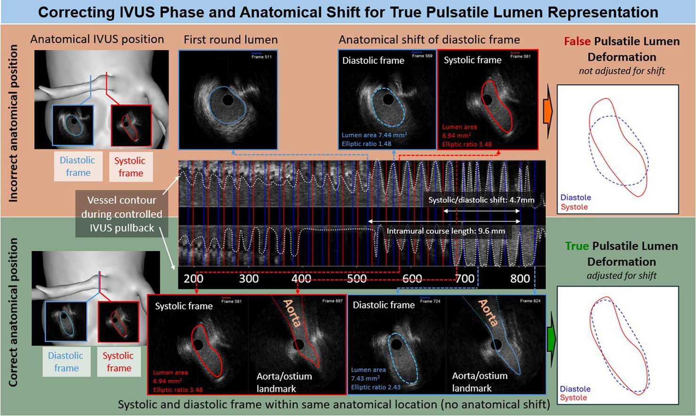
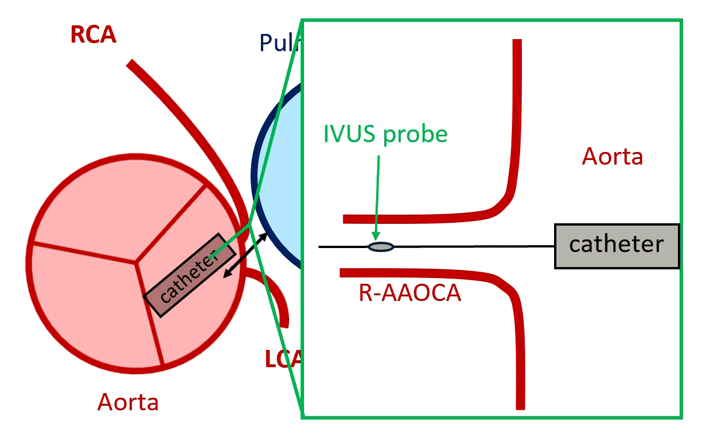

.. docs/contents/modules/gating.rst

Gating (IVUS)
=============

*Part of the* :doc:`intravascular` *module (IVUS only).*

An IVUS pullback is acquired continuously while the heart beats, so consecutive frames
alternate between a relaxed (diastolic) and a compressed (systolic) vessel. Comparing
measurements only makes sense within one phase. This is especially important when trying
to compare phases between each other. This is apparent by the relative motion of reference
points (e.g., the ostium) during every heartbeat, as we have already published before:

   :ref:`Stark et al. 2025 <gating-citation-1>`

This shift which we described can be contributed to the fact that with every heartbeat,
the vessel moves relative to the catheter. Which I also demonstrate in this idealized example:

HolOrama identifies the phases **from the images themselves** (image-based gating) and 
additionally **from the contours** (contour-based gating), using the algorithm published as
*AIVUS-CAA* (:ref:`Stark et al. 2025 <gating-citation-2>`), however optimized since then.

How it works
------------

Two independent signals are extracted along the pullback and bandpass-filtered around the
detected heart rate.

.. list-table::
   :header-rows: 1
   :widths: 22 78

   * - Signal
     - Definition
   * - **Image** (green)
     - ``s[n] = 1 − NCC(frame_n, frame_n+1)``: one minus the normalised cross-correlation
       of consecutive frames, computed on a central crop so that the burnt-in frame number
       does not contribute. Always available, even before a single contour is drawn. Its
       peaks are the **maximum-motion** frames, timing landmarks rather than stable phase
       points.
   * - **Contour** (yellow)
     - The lumen area per frame, in mm², taken from the report data. Requires contours on
       at least 50 % of the frames. Its **peaks are diastole** (large, relaxed lumen) and
       its **troughs are systole** (small, compressed lumen).

.. rubric:: Heart-rate detection

The cardiac frequency is estimated as the FFT spectral peak of the correlation signal
inside the configured search range (``gating.f_cardiac_min`` / ``f_cardiac_max``, default
0.75–3.33 Hz ≈ 45–200 bpm). This covers resting and stress acquisitions without any
grid search.

.. rubric:: Filtering

Both signals are bandpass-filtered (Butterworth, zero-phase) at
``[bandpass_lo_frac, bandpass_hi_frac] × f_heart``, by default 0.7 to 2.2 × the heart
rate. The lower cutoff removes the slow pullback trend, the upper one removes speckle
noise while keeping the second harmonic.

.. rubric:: Turning-point detection

Extrema are found with a hysteresis-gated walker rather than a global threshold: a local
maximum is only registered once the signal has fallen back by more than 15 % of the
peak-to-peak range, and vice versa. This is amplitude-agnostic, needs no minimum-distance
parameter, and produces a naturally alternating max/min sequence that maps directly onto
diastole and systole.

.. note::
   Compared with the original publication, the blur signal, the centroid-vector signal and
   the weight optimisation were removed: on real IVUS data they added noise to an otherwise
   clean correlation signal. The centroid vector in particular is dominated by catheter
   rotation (SNR 0.04, versus 1.54 for lumen area).

Tutorial
--------

Prerequisites
~~~~~~~~~~~~~

- An IVUS pullback loaded in the :doc:`intravascular` module.
- Optional but strongly recommended: lumen contours on at least half the frames (draw them
  or run **Automatic Segmentation**). Without them only the image signal is available, and
  the phase assignment is less reliable.

1. Run the gating
~~~~~~~~~~~~~~~~~

Click **Extract Diastolic and Systolic Frames** (bottom right), or use
**Run → Extract Diastolic and Systolic Frames**.

A dialog asks for the **lower** and **upper frame limit**. Restrict this to the part of the
pullback you actually want to analyse: excluding the run-in and any segment where the
catheter is not moving cleanly gives a better heart-rate estimate.

2. Read the plot
~~~~~~~~~~~~~~~~

The gating plot appears in the top right of the window:

- **Solid green**: the filtered image signal.
- **Solid yellow**: the filtered contour (lumen-area) signal.
- **Dashed** curves below them: the same signals unfiltered, for reference.
- **Vertical lines**: the gated frames. Blue = diastole, red = systole, grey = untyped.

If no gated frames exist yet, an automatic estimate is placed for you as soon as the plot
opens. If gating results already exist, they are drawn instead and left untouched.

3. Correct the result
~~~~~~~~~~~~~~~~~~~~~

The plot is interactive:

- **Click** anywhere on the plot to add a marker line at that frame; the image display
  jumps to it so you can check the frame immediately.
- **Click near an existing line** to select it (it turns dashed), then **drag** it to a
  neighbouring frame.
- **Drag a line downward, out of the axes**, to remove it.
- Use the matplotlib toolbar above the plot to zoom and pan. While a toolbar tool is
  active, clicking does not create markers.
- **Compare Frames** opens a small second display showing the nearest frame of the selected
  phase, the quickest way to confirm that two frames really are in the same phase.

Two diagnostic views sit in the bottom-left corner of the plot:

- **Freq. sweep**: a heat map of the image signal low-pass filtered at increasing BPM
  cutoffs. The yellow line marks the active cutoff (starting at 2 × the detected heart
  rate); click a row to apply that cutoff to the main plot. Use it when the automatic heart
  rate looks wrong.
- **Breathing sweep**: the same idea for the breathing frequency, see :doc:`breathing`.

4. Fix phases in bulk
~~~~~~~~~~~~~~~~~~~~~

- :kbd:`Alt+Delete`: choose a frame range and remove all gating within it.
- :kbd:`Alt+S`: choose a frame range and swap systole and diastole within it. Useful when
  the automatic assignment is systematically inverted over one segment.
- **Edit → Reset Phases** clears everything and starts over.

Individual frames can always be re-tagged with the *Diastolic Frame* / *Systolic Frame*
checkboxes.

5. Work with the gated frames
~~~~~~~~~~~~~~~~~~~~~~~~~~~~~

- The **Diastolic Frames** / **Systolic Frames** toggle decides which phase :kbd:`W` and
  :kbd:`S` traverse.
- :kbd:`Shift+W` / :kbd:`Shift+S` copy the active contour from the next/previous gated
  frame; contouring a gated series is mostly copy-and-adjust.
- :kbd:`Alt+P` plots the results for the gated frames (area difference between systole and
  diastole over the pullback distance).
- **File → Save NIfTis → Gated Frames** exports only the gated frames.

The gated frames are also what the :doc:`fusion` module consumes: the report writes
``diastolic_contours.csv`` and ``systolic_contours.csv``, which become the diastolic and
systolic geometries there.

Troubleshooting
---------------

.. list-table::
   :header-rows: 1
   :widths: 38 62

   * - Symptom
     - What to try
   * - Only the green curve carries information
     - Fewer than 50 % of frames have contours. Draw more, or run **Automatic
       Segmentation** first.
   * - Markers are placed at roughly double or half the true rate
     - The heart-rate estimate is off. Open **Freq. sweep** and pick a better cutoff, or
       narrow ``f_cardiac_min`` / ``f_cardiac_max`` in ``config.yaml``.
   * - Diastole and systole are swapped over part of the pullback
     - Select that range with :kbd:`Alt+S`.
   * - Markers are noisy in one segment
     - Re-run the gating with a frame range restricted to the clean segment, or correct the
       lines by hand.

References
----------

.. _gating-citation-1:

1. Stark, A. W., Bigler, M. R., Räber, L., Gräni, C. (2025). *True pulsatile lumen
   visualization in coronary artery anomalies using controlled transducer pullback and
   automated IVUS segmentation.* JACC: Case Reports, 30(22), 104741.
   `doi:10.1016/j.jaccas.2025.104741 <https://doi.org/10.1016/j.jaccas.2025.104741>`_

.. _gating-citation-2:

2. Stark, A. W., Kazaj, P. M., Balzer, S., Ilic, M., Bergamin, M., Kakizaki, R.,
   Giannopoulos, A., Haeberlin, A., Räber, L., Gräni, C. (2025). *Automated intravascular
   ultrasound image processing and quantification of coronary artery anomalies: the HolOrama
   software.* Computer Methods and Programs in Biomedicine, 109065.
   `doi:10.1016/j.cmpb.2025.109065 <https://doi.org/10.1016/j.cmpb.2025.109065>`_
