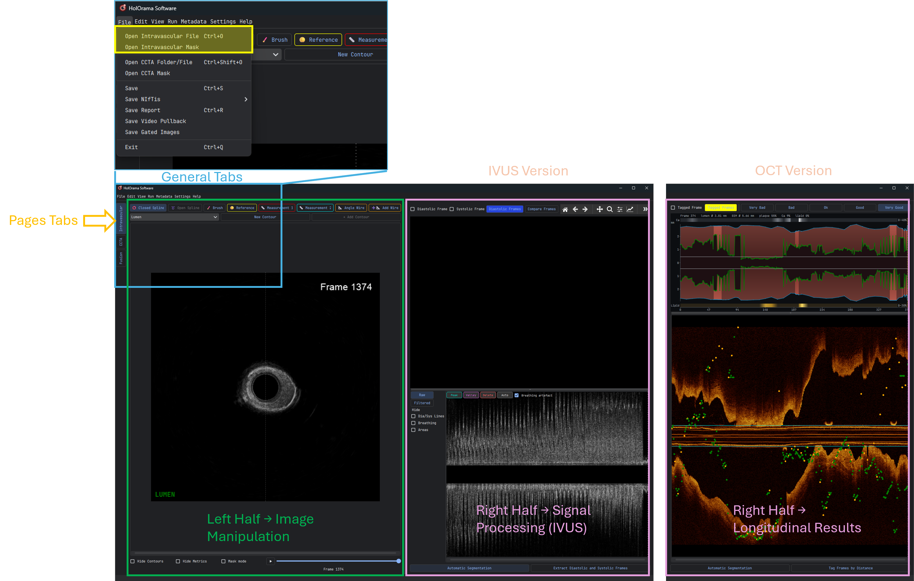
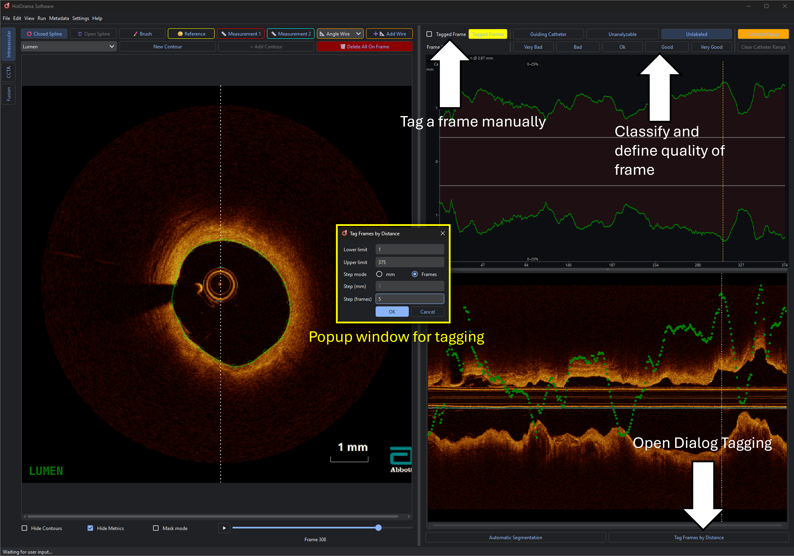
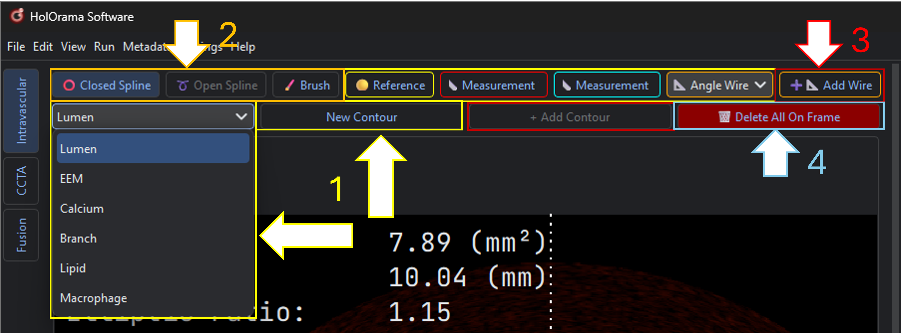
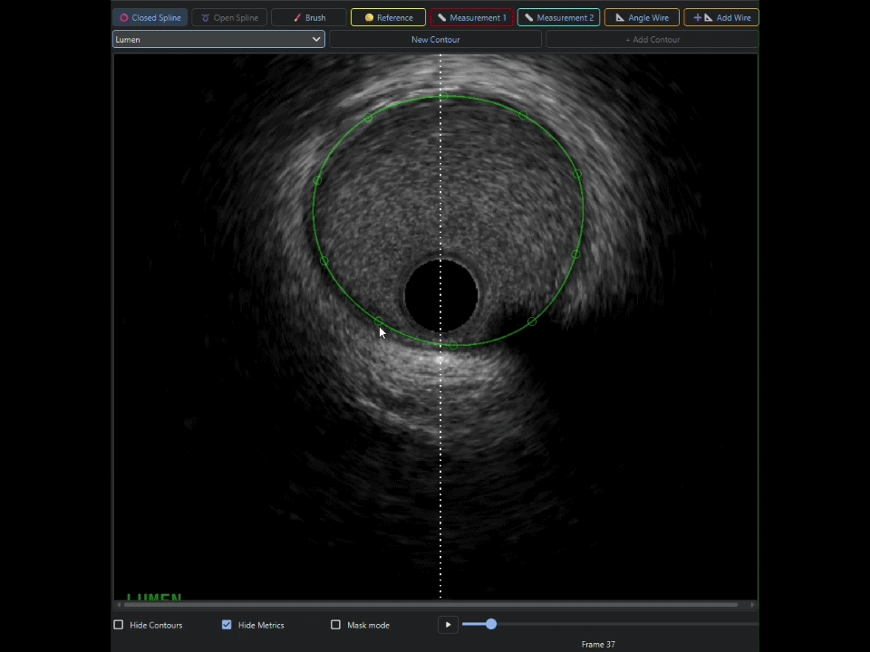
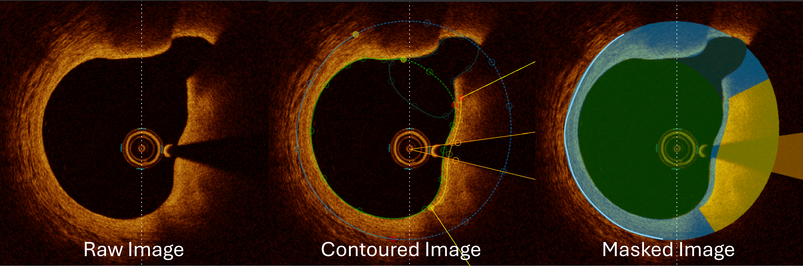

.. docs/contents/modules/intravascular.rst

Intravascular (IVUS / OCT)
==========================

The intravascular module is where a pullback is annotated: you step through frames, draw
contours with the tool that matches the structure, mark where you are uncertain, and export
the result, as a metrics report, as contour CSVs, or as image/mask NIfTI pairs ready to
train a segmentation model.

Both modalities share the same contouring tools. IVUS pullbacks additionally get
:doc:`gating` and :doc:`breathing`; OCT pullbacks instead get frame *tagging* and a
per-frame image-quality rating.

The layout
----------

.. rubric:: Left half: the image

- **Row 1, drawing tools:** ⭕ **Closed Spline**, ➰ **Open Spline**, 🖌️ **Brush**,
  🟡 **Reference**, 📏 **Measurement 1**, 📏 **Measurement 2**, 📐 **Angle Wire**,
  ➕📐 **Add Wire**.
  Exactly one is active at a time; which ones are enabled depends on the selected contour
  type.
- **Row 2, contour selector:** a dropdown (Lumen / EEM / Calcium / Branch / Lipid /
  Macrophage) plus **New Contour** and **+ Add Contour**.
- **The image**, with a frame slider, a play button and a frame counter underneath.
- **Checkboxes:** *Hide Contours*, *Hide Metrics*, *Mask mode*.

.. rubric:: Right half: the signals

- **Frame tagging** (IVUS): *Diastolic Frame* / *Systolic Frame* checkboxes, the
  **Diastolic Frames** / **Systolic Frames** toggle that decides which phase :kbd:`W` and
  :kbd:`S` traverse, and **Compare Frames**.
- **Frame tagging** (OCT): *Tagged Frame*, **Tagged Frames**, and the five quality buttons
  *Very Bad* → *Very Good*.
- **Gating plot** (IVUS only, top) (see :doc:`gating`).
- **Longitudinal view** (bottom) with a **Raw** / **Filtered** selector and *Hide*
  checkboxes for the dia/sys marker lines, the breathing curve and the area dots.
- **Automatic Segmentation** and **Extract Diastolic and Systolic Frames** (IVUS) or
  **Tag Frames by Distance** (OCT) along the bottom.

   Overview of the intravascular page layout.

Tutorial
--------

1. Open a pullback
~~~~~~~~~~~~~~~~~~

**File → Open Intravascular File** (or :kbd:`Ctrl+O`) and pick a DICOM or NIfTI file. Test cases
for IVUS and OCT can be downloaded from github to follow along.

The modality is detected from the data, and the right half rebuilds itself accordingly
(see :ref:`fig-overview-intravascular`). **Metadata → Show Metadata** lists
the DICOM tags.

If you already have a segmentation mask, load it with **File → Open Intravascular Mask**, this works for any nifti mask which is
then turned into contours.

2. Set the window and zoom
~~~~~~~~~~~~~~~~~~~~~~~~~~

- Drag :kbd:`RMB` left/right and up/down to change window level and width; :kbd:`R` resets.
- Drag :kbd:`LMB` up/down to zoom around the cursor; :kbd:`F` resets.
- Drag :kbd:`Ctrl`\ +\ :kbd:`LMB` to pan the image inside its widget.
- :kbd:`C` toggles the colour map.

Sensitivity of both windowing and zoom is configurable; see :doc:`../configuration`.

3. Tagging / Gating Images
~~~~~~~~~~~~~~~~~~~~~~~~~~

The first step should be to only analyze frames of interest. This can either be done by
tagging images in OCT or gating in IVUS; both matter because they let you export only the
tagged / gated frames as nifti for training.

**IVUS.** Mark the current frame with the *Diastolic Frame* / *Systolic Frame* checkboxes,
or let :doc:`gating` find them for you. Gating requires a bit more effort and is covered
in detail there. Marked frames appear as lines in the longitudinal view (blue = diastole,
red = systole) and are traversable with :kbd:`W` / :kbd:`S`. Use :kbd:`Alt+S` to swap
systole and diastole over a range.

**OCT.** Mark frames with *Tagged Frame*, or use **Tag Frames by Distance** to tag frames
at regular distance intervals within a frame range. Rate each frame with the quality
buttons (*Very Bad* … *Very Good*). The rating travels with the frame into the report.

If a region should be excluded from analysis, after running tagging / gating use
:kbd:`Alt+Delete` and provide a range to exclude.

   Tagging a pullback after loading a presegmented mask.

4. Navigate frames
~~~~~~~~~~~~~~~~~~

- :kbd:`A` / :kbd:`D` (or :kbd:`←` / :kbd:`→`, or the mouse wheel) step one frame.
- :kbd:`W` / :kbd:`S` jump to the next/previous **gated** / **tagged** frame, in whichever phase the
  **Diastolic Frames** / **Systolic Frames** / **Tagged** toggle currently selects. If no frames are
  gated or tagged just defaults to the next lower or higher frame.
- :kbd:`J` jiggles around the current frame, which is a quick way to judge a border by motion.
- The play button under the image runs through the pullback.
- Scrolling the :kbd:`MWB` also lets you run through frames.
- The scrollbar on the bottom can additionally be used to scim through frames either automatically
  by pressing the play button or by moving the position marker

5. Optional: pre-segment the lumen
~~~~~~~~~~~~~~~~~~~~~~~~~~~~~~~~~~~

For IVUS **Automatic Segmentation** runs the configured deep-learning model over every frame and
produces lumen contours you can then correct by hand, usually much faster than drawing
from scratch. These contours are also necessary for the gating algorithm, which is the reason
why we provided them. However, it is possible to load results from external deep learning segmentation
models as demonstrated in :ref:`fig-tagging`

.. note::
   Only available in a source installation, and currently trained for the **IVUS lumen**
   only. Training set consisted of coronary artery anomalies. The model path and 
   inference settings are in the ``segmentation`` section of ``config.yaml``. 
   The packaged Windows binary does not include inference.

6. Draw contours
~~~~~~~~~~~~~~~~

.. important::
  Understanding the available tools for segmentation well, can result in the most relevant
  speed up of your segmentations and Human-in-the-Loop models. The key skill here is to 
  master all the shortcuts.
  To my fellow physicians, I know that most medical software is centered around click-based
  approaches, however this shortcut-based approach takes some getting used to, but made
  me significantly faster in my segmentation work. As everything in HolOrama, the software
  was adjusted to real world tasks, and therefore reflects also my own learnings over time.

Pick the structure in the contour dropdown (or press its shortcut), pick a drawing tool,
then click in the image to place points.

  Everything can either be selected manually via the buttons, as displayed in this figure.
  Yellow, contour selection from the drop down menu and with ``new_contour`` button. Orange,
  the different tools to draw this contour and lastly the buttons to add
  additional contours. Everything can also be triggered with key combinations (see also below).

.. list-table::
   :header-rows: 1
   :widths: 20 14 14 52

   * - Contour type
     - New
     - Add another
     - Available tools
   * - Lumen
     - :kbd:`E`
     - —
     - ⭕closed spline, 🖌️ brush
   * - EEM
     - :kbd:`Q`
     - —
     - ⭕closed spline, 🖌️ brush
   * - Calcium
     - :kbd:`7`
     - :kbd:`Ctrl+7`
     - ➰open spline, ⭕closed spline, 🖌️ brush
   * - Side branch
     - :kbd:`8`
     - :kbd:`Ctrl+8`
     - ⭕closed spline, 🖌️ brush
   * - Lipid
     - :kbd:`9`
     - :kbd:`Ctrl+9`
     - ➰open spline, ⭕closed spline, 🖌️ brush
   * - Macrophage
     - :kbd:`0`
     - :kbd:`Ctrl+0`
     - ➰open spline, ⭕closed spline, 🖌️ brush
   * - Wire
     - :kbd:`3`
     - :kbd:`Ctrl+3`
     - —

.. note::
  To return to a neutral state (no tool, Lumen as active contour), 
  press :kbd:`Esc`.

Drawing rules:

- **Closed spline**: left-click to place knot points, then click the first point again to
  close the contour.
- **Open spline**: left-click to place points; the contour stays open. For calcium, the
  angle from the lumen centre to the start and end point is computed automatically.
- **Brush**: paint the structure directly. Requires *Mask mode* to be enabled; **hover the
  🖌️ button to get the radius popup**.
- Drag an existing knot point. To move it, click on the contour line to insert a new point.
  :kbd:`RMB` on a knot point removes it.
- :kbd:`Ctrl`\ +\ mouse wheel shrinks or expands the active contour. Every knot point
  moves one pixel per tick toward or away from the centroid.
- Clicking any drawn contour makes it the active one.
- :kbd:`Esc` leaves drawing mode; :kbd:`Ctrl+Z` undoes the last contour edit (draw, delete,
  drag, brush, scale or copy; the last five edits are kept).

Several shortcuts save a lot of clicking, but don't have a button representation:

- :kbd:`Shift+Q` spawns an EEM contour from the existing lumen contour on the current
  frame, by expanding its knot points radially from the lumen centroid. It does nothing if
  an EEM contour already exists there.
- :kbd:`Shift+A` / :kbd:`Shift+D` copy the active contour from the previous/next frame;
  :kbd:`Shift+S` / :kbd:`Shift+W` copy it from the previous/next gated or tagged frame
  (only when the current frame is itself gated/tagged).

See this example for applying these tools to effectively draw new contours:

   Example for a workflow utilizing the different contour spawning shortcuts.

.. _iv-uncertainty:

7. Express uncertainty
~~~~~~~~~~~~~~~~~~~~~~

Borders are not equally visible all the way around a vessel. Rather than forcing you to
guess, HolOrama lets the annotation itself carry that information, by creating a separate mask
for solid lines, which is what makes the exported masks honest training data.

There are three ways to record it:

.. list-table::
   :header-rows: 1
   :widths: 26 74

   * - Situation
     - What to do
   * - The whole border is clear
     - Draw a **closed spline**. This is the unambiguous case.
   * - Part of the border is not interpretable (shadowing, guide-wire artefact, poor
       contact)
     - Draw a **closed spline with an uncertain region**: double-click to place a **start
       point** (yellow) and an **end point** (red). The arc between them is marked as
       uncertain rather than asserted.
   * - Only a segment of the structure is visible at all (typical for calcium, lipid,
       macrophages)
     - Draw an **open spline**. Nothing is claimed about the part you cannot see.

Example for when part of the border is not interpretable and for a case where only an
open spline is drawn because part of the structure is not visible at all:

   Left: Raw image without contours. Middle: contours with open start and end points
   on the EEM contour and an open spline for the lipid. Right: The corresponding mask.

Colours of the start/end markers are configurable (``color_start_point``,
``color_end_point``).

.. tip::
   Be consistent about *why* you mark a region uncertain across a study; that consistency
   is what a model can actually learn from.

8. Measurements and markers
~~~~~~~~~~~~~~~~~~~~~~~~~~~

- 📏 **Measurement 1** (:kbd:`1`) and **Measurement 2** (:kbd:`2`) each measure a distance
  between two clicked points. Both are stored per frame and end up in the report.
- 📐 **Angle Wire** (:kbd:`3`) marks the guide-wire shadow as an angular sector: click two
  points and the sector between the two radial lines through them becomes the shadow.
  ➕📐 **Add Wire** (:kbd:`Ctrl+3`) marks another wire on the same frame, keeping the ones
  already there; some pullbacks show more than one wire. Drawing with **Angle Wire**
  instead replaces every wire on the frame. Wires behave like the other multi-instance
  contours (calcification, lipid, …): each is stored separately, all of them are exported
  to the mask (label 9), and :kbd:`Ctrl+Z` undoes the last one.
- 🟡 **Reference** places a reference point on the frame. This point defines the rotational
  reference used when the pullback is later aligned in the :doc:`fusion` module.
- :kbd:`G` hides the measurement overlays, :kbd:`H` hides all contours.

Lumen area, EEM area, elliptic ratio and the other per-frame metrics are computed
automatically as you draw.

The ``Measurement 1`` and ``Measurement 2`` are especially important in the preparation of
coronary artery anomalies for fusion with CCTA. Also the reference points should specifically,
set either at the ostium or at bifurcation points. A detailed description of how the input format
for the fusion module is expected is given in :doc:`fusion`.

9. Review in the longitudinal view
~~~~~~~~~~~~~~~~~~~~~~~~~~~~~~~~~~

The longitudinal view under the gating plot shows the pullback cut along its axis,
overlaid with the lumen-area dots, the diastolic/systolic marker lines and the breathing
curve. Each overlay can be hidden independently with the *Hide* checkboxes, and the
**Raw** / **Filtered** buttons switch between acquisition order and breathing-corrected
order (see :doc:`breathing`).

This is the fastest way to spot a contour that is out of line with its neighbours.

Additionally, the OCT module provides an overview of the longitudinal view, showing lumen diameter,
EEM diameter, calcification distribution on top and lipid distribution on the bottom.
This is a quick way to spot regions of interest, which can then be inspected in the 
image view and annotated with the contouring tools.

10. Export
~~~~~~~~~~

.. list-table::
   :header-rows: 1
   :widths: 34 66

   * - Action
     - Result
   * - **File → Save** (:kbd:`Ctrl+S`)
     - Writes the contour/tag JSON next to the opened file. Auto-save does this every
       10 s by default and when changing any contour.
   * - **File → Save Report** (:kbd:`Ctrl+R`)
     - Per-frame metrics report, plus the contour CSVs when ``report.save_as_csv`` is on.
       **These CSVs are the Fusion module's intravascular input.**
   * - **File → Save NIfTis → Contoured / Gated / All Frames**
     - Image and mask NIfTI files for the chosen frame selection.
   * - **File → Save Gated Images**
     - The gated (or tagged) frames as numpy arrays (.npy).
   * - **File → Save Video Pullback**
     - The pullback as a video file.

See :doc:`../outputs` for the exact file names and directory layout.

.. rubric:: Masks for model training

The NIfTI export is the intended bridge to model training: masks are rasterised from your
contours using a fixed layering ruleset, so overlapping structures resolve the same way
every time. Choose **All Frames** for a dense dataset, or **Contoured Frames** to export
only what you actually annotated. ``save.save_2d`` and ``save.save_3d`` control whether you
get one file per frame, a single 3D volume, or both.

Example Video
-------------
An example of OCT segmentation workflow.

.. raw:: html

   

     <video width="900" style="max-width: 100%; height: auto;" controls>
       <source src="../../tutorial_video.mp4" type="video/mp4">
       Your browser does not support the video tag.
     </video>
   

Next steps
----------

- IVUS: continue with :doc:`gating`, then :doc:`breathing`.
- Feeding the fusion pipeline: save a report (with ``save_as_csv: True``) so the contour
  CSVs exist, then go to :doc:`fusion`.
- All shortcuts on one page: :doc:`../shortcuts`.
