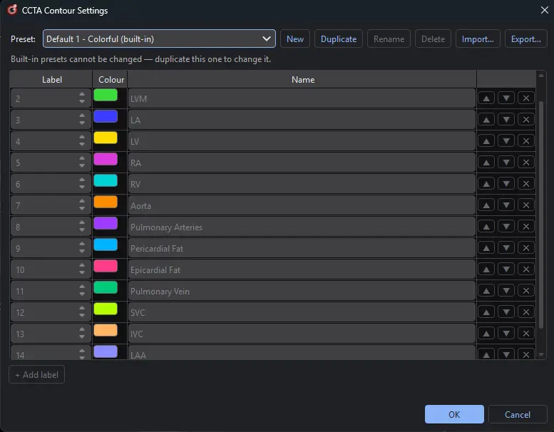
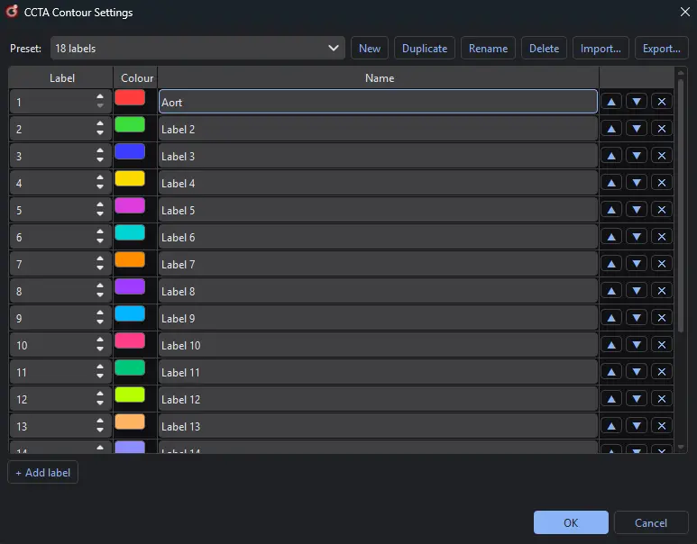
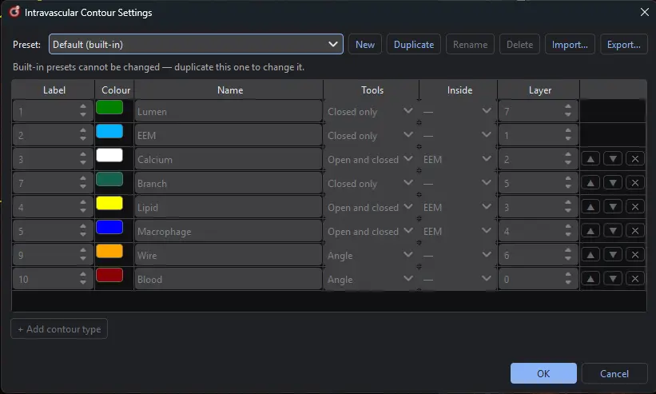

.. docs/contents/modules/mask_definition.rst

Mask Definitions
================

Out of the box, HolOrama is set up for fusing intravascular imaging with CCTA in coronary
artery anomalies and coronary artery disease. The software itself is generic, though, and works
with any IVUS/OCT or CCTA segmentation. Want to add stent or thrombus segmentation? Segment the
whole aorta instead of only the coronaries? You can define your own masks in **presets**. A
preset says which label value in a mask stands for which structure, and how each one is named,
coloured and (for intravascular images) drawn. Every preset is a single JSON file, so you can
export it and share it with your co-workers.

Both modules have their own presets and their own settings dialog:

- **Settings → CCTA Contour Settings…** for the labels of a CCTA mask
  (see `Tutorial CCTA`_).
- **Settings → Intravascular Contour Settings…** for the contour types of an IVUS or OCT
  pullback (see `Tutorial Intravascular`_).

The two dialogs work the same way. The **Preset** drop-down picks the preset you're editing,
and the buttons next to it manage presets:

.. list-table::
   :header-rows: 1
   :widths: 20 80

   * - Button
     - What it does
   * - New
     - Starts an empty preset (on the intravascular side, one with only the lumen and the EEM).
   * - Duplicate
     - Copies the selected preset, so you can change it.
   * - Rename / Delete
     - Renames or deletes one of your own presets.
   * - Import… / Export…
     - Reads a preset someone shared with you, or writes the selected one to a JSON file to
       share.

Built-in presets are read-only: duplicate one to change it. Nothing is saved until you press
**OK**. After that, the page uses the selected preset, and HolOrama remembers your choice in
``config.yaml`` (``intravascular.contour_preset`` and ``ccta.contour_preset``, see
:doc:`../configuration`). **Cancel** discards every change you made in the dialog.

Where presets are stored
------------------------

The built-in presets ship with the application. Your own presets are saved one file per preset:

.. list-table::
   :header-rows: 1
   :widths: 30 70

   * - Version
     - Folder
   * - Compiled (Windows installer)
     - ``%LOCALAPPDATA%\HolOrama\presets\intravascular`` and
       ``%LOCALAPPDATA%\HolOrama\presets\ccta``
   * - Cloned repository (run from source)
     - ``presets/intravascular`` and ``presets/ccta`` at the repository root. The folder is
       ignored by git, so your presets stay out of commits.

To share a preset, use **Export…** and send the file. You can also copy it straight into one of
these folders, and it will show up in the drop-down the next time you open the dialog.

Tutorial CCTA
-------------

A CCTA preset gives each mask value a name and a colour. Two built-in presets have the same
names and differ only in colour: **Default 1 - Colorful** for working and **Default 2 -
Publication** for figures. The **Switch default** button above the label list on the CCTA page
toggles between them.

   The built-in CCTA preset *Default 1 - Colorful*: one row per mask value, with its colour and
   name.

The default labels cover all the structures published in Mohammadi Kazaj, P., Weber, L. F.,
Xie, W., Safavi-Naini, S. A. A., Stark, A., Baj, G., Mokhtari, A., Yoshida, T., Ryffel, C.,
Okuno, T., Akashi, Y., Buechel, R. R., Pilgrim, T., Valenzuela, W., Siontis, G. C. M., Xu, X.,
Hundertmark, M., Windecker, S., Gräni, C., Shiri, I. (2026). *A unified framework for
comprehensive cardiac CT segmentation and phenotyping: human-in-the-loop data annotation,
vision foundation model development, multicenter evaluation and clinical validation.* arXiv
preprint arXiv:2607.11287.

Each row has three columns:

.. list-table::
   :header-rows: 1
   :widths: 20 80

   * - Column
     - Meaning
   * - Label
     - The value in the mask (1-255). Every label appears at most once.
   * - Colour
     - The colour of the label in the 2D views and in 3D. Click the swatch to change it.
   * - Name
     - The name of the label everywhere on the CCTA page.

A mask is named and coloured as soon as it's loaded. Names are changed only in this dialog,
not on the CCTA page, so every view uses the same names. A value the active preset doesn't
know is shown as *Label <value>*, in a colour of its own.

**Loading a mask with unknown labels.** If the mask you load holds labels the active preset
doesn't name (a whole-body segmentation, say), HolOrama asks whether to create a new preset for
it. If you choose **Yes**, CCTA Contour Settings opens on an unsaved preset with one row per
mask value, each in a distinct colour and named *Label <value>*. Name the rows and press
**OK**. The example below is a mask with 18 labels, with the first row already being renamed:

   The new preset HolOrama prepares for a mask whose labels the active preset doesn't name.

You can also start a preset yourself with **New** or **Duplicate**, or load a shared one with
**Import…**. Use **+ Add label** to add a row, and the arrow and ✕ buttons to reorder or remove
rows.

Tutorial Intravascular
----------------------

On the intravascular page, the preset defines the **contour types**: the structures you draw
on a pullback, and how each one is written into an exported mask. The built-in **Default**
preset looks like this:

   The built-in intravascular preset *Default*.

The preset also sets what the page offers: the contour-type drop-down, the colours, and the
**Edit** menu entries and keyboard shortcuts are all built from it.

Columns
~~~~~~~

Unlike a CCTA mask, an intravascular mask is drawn rather than only shown, so each row has
three more columns:

.. list-table::
   :header-rows: 1
   :widths: 15 85

   * - Column
     - Meaning
   * - Label
     - The value the type is written into the exported mask as (1-255). Every label appears at
       most once.
   * - Colour
     - The colour it's drawn and overlaid in.
   * - Name
     - Its name everywhere in the app.
   * - Tools
     - What it can be drawn with:

       - *Closed only*: a closed spline, such as the lumen or a side branch.
       - *Open and closed*: also an open arc, for plaque that reaches the vessel wall.
       - *Angle*: a sector about the catheter, such as the guidewire shadow or a blood
         artefact.

       The brush comes with every spline type. Once a type has been saved, a spline type stays
       a spline type and an angle stays an angle, so contours already drawn with it keep their
       meaning.
   * - Inside
     - The type it lies inside, its **container**. Its region is clipped to the container and
       kept out of the lumen. An open arc fills outwards from the arc up to the container's
       boundary, which is why every *Open and closed* type needs one. Angles lie inside
       nothing.
   * - Layer
     - Its place in the mask. Wherever two regions overlap, the one with the higher layer is
       the one written into the mask.

The **lumen** and the **EEM** are always the first two rows. They're required, closed only and
lie inside nothing, and only their colour, name, label and layer can change. You add every
other row with **+ Add contour type**, and reorder or remove it with the arrow and ✕ buttons.
The order of the rows sets the keyboard shortcuts:

- Spline types get ``E`` (the lumen), ``Q`` (the EEM), then ``7``, ``8``, ``9`` and ``0``.
- Angles get ``3`` and ``B``.

Except for the lumen and the EEM, each of these keys pressed with :kbd:`Ctrl` adds another
contour of that type to the frame.

Rows beyond these slots have no shortcut and are picked from the drop-down. The Default preset
uses the same shortcuts as earlier versions of HolOrama.

Layers
~~~~~~

The mask is painted bottom to top in layer order, so each layer covers the ones beneath it.
These rules apply:

- A type has to be layered above its container, or the container would cover it completely.
- The lumen has to be layered above the EEM.
- Layers are unique.

Nothing else is fixed, so a type can sit above the lumen, such as a thrombus inside it. In the
Default preset, the blood artefact is the bottom layer and the EEM is just above it. Next come
the plaque types, then the side branch, then the wire shadow, with the lumen on top.

If a preset breaks a rule, the dialog says which rule, and **OK** stays disabled until it's
fixed.

Example: adding a stent
~~~~~~~~~~~~~~~~~~~~~~~

#. Open **Settings → Intravascular Contour Settings…**, select *Default* and press
   **Duplicate**. Name the copy, for example *OCT stent*.
#. Press **+ Add contour type**, name the new row *Stent* and pick a free label (for example
   ``11``) and a colour.
#. Set **Tools** to *Closed only* and **Inside** to *—*.
#. Give it a layer above the lumen (for example ``8``) so that its outline stays visible in the
   mask.
#. Press **OK**. *Stent* is now in the contour-type drop-down and the **Edit** menu, and exports
   write it as label ``11``.

Loading an intravascular mask
~~~~~~~~~~~~~~~~~~~~~~~~~~~~~

**File → Open Intravascular Mask** turns a mask back into editable contours after the active
preset. Each label value becomes the contour type with that label, on every frame, replacing
the contours there. One :kbd:`Ctrl+Z` undoes the whole import. Because the mask was painted
in layers, parts of most types are hidden under others, and HolOrama reconstructs them:

- Hidden parts are **bridged** rather than traced. The EEM comes back as a smooth vessel wall
  instead of following the lumen or dipping into the wire shadow.
- **Angles** come back as sectors about the image centre.
- A type that lies **inside** another comes back as:

  - an *open arc* if it reaches its container's boundary along at least 85% of its span,
  - a *ring* if it does so all the way round the lumen,
  - a *closed* contour otherwise.

- Components under 20 pixels are ignored as noise.

If the mask holds labels the active preset doesn't define, HolOrama asks, as on the CCTA page,
whether to create a new preset with a row for each of them. Choose **Yes** to open
Intravascular Contour Settings on that preset, set the new rows' tools, container and layer,
and press **OK**: the mask is then read with the new preset. **No** reads the mask with the
active preset and leaves the unknown labels out, and **Cancel** doesn't load the mask.

See :doc:`intravascular` for drawing contours and exporting masks.
