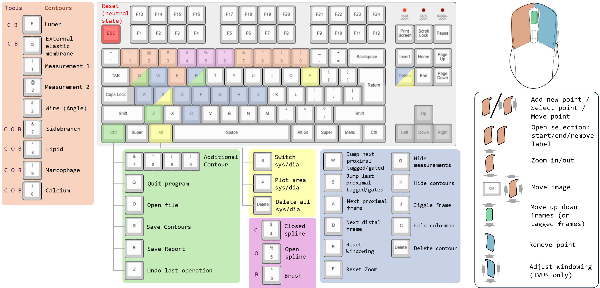
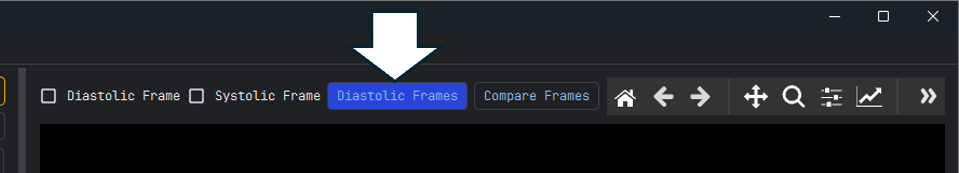

.. docs/contents/shortcuts.rst

Keyboard & mouse reference
==========================

Shortcuts cannot currently be remapped from the interface — changing them requires editing
``src/gui/shortcuts.py``.

   Overview of the intravascular keyboard layout. The tables below are authoritative if the
   two ever disagree.

Application-wide
----------------

.. list-table::
   :header-rows: 1
   :width: 100%
   :widths: 30 70

   * - Shortcut
     - Action
   * - :kbd:`Ctrl+O`
     - Open an intravascular (IVUS/OCT) DICOM or NIfTI file
   * - :kbd:`Ctrl+Shift+O`
     - Open a CCTA DICOM folder or NIfTI file
   * - :kbd:`Ctrl+S`
     - Save either contours and tags on the Intravascular module, or the mask on the CCTA module
   * - :kbd:`Ctrl+R`
     - Generate and save the report
   * - :kbd:`Ctrl+Q`
     - Close the application, saves contours before closing

Intravascular module
--------------------

Navigation
~~~~~~~~~~

.. list-table::
   :header-rows: 1
   :width: 100%
   :widths: 30 70

   * - Shortcut
     - Action
   * - :kbd:`A` / :kbd:`←`
     - Previous frame
   * - :kbd:`D` / :kbd:`→`
     - Next frame
   * - :kbd:`S` / :kbd:`↓`
     - Previous gated frame (of the selected phase)
   * - :kbd:`W` / :kbd:`↑`
     - Next gated frame (of the selected phase)
   * - Mouse wheel
     - Scroll through frames
   * - :kbd:`J`
     - Jiggle around the current frame

.. note::
  Which phase :kbd:`W` and :kbd:`S` traverse is set by the **Diastolic Frames** /
  **Systolic Frames** toggle (blue = diastole, red = systole).

Drawing
~~~~~~~

.. list-table::
   :header-rows: 1
   :width: 100%
   :widths: 30 70

   * - Shortcut
     - Action
   * - :kbd:`E`
     - New ``lumen`` contour
   * - :kbd:`Q`
     - New ``EEM`` contour
   * - :kbd:`Shift+Q`
     - Spawn an ``EEM`` contour from the existing ``lumen`` contour on this frame (radial
       expansion from the lumen centroid); does nothing if an EEM already exists
   * - :kbd:`7` / :kbd:`Ctrl+7`
     - New / additional ``calcification`` contour
   * - :kbd:`8` / :kbd:`Ctrl+8`
     - New / additional ``side branch`` contour
   * - :kbd:`9` / :kbd:`Ctrl+9`
     - New / additional ``lipid`` contour
   * - :kbd:`0` / :kbd:`Ctrl+0`
     - New / additional ``macrophage`` contour
   * - :kbd:`4` / :kbd:`5` / :kbd:`6`
     - Select the closed-spline / open-spline / brush tool
   * - :kbd:`1` / :kbd:`2`
     - Draw measurement 1 / measurement 2
   * - :kbd:`3` / :kbd:`Ctrl+3`
     - Draw a new / additional wire-shadow angle (a frame may carry several wires)
   * - :kbd:`Delete`
     - Delete the active contour
   * - :kbd:`Ctrl+Z`
     - Undo the last contour edit — draw, delete, drag, brush, scale or copy (last 5 kept)
   * - :kbd:`Esc`
     - Leave drawing mode, return to a neutral state

Copying contours between frames
~~~~~~~~~~~~~~~~~~~~~~~~~~~~~~~

.. list-table::
   :header-rows: 1
   :width: 100%
   :widths: 30 70

   * - Shortcut
     - Action
   * - :kbd:`Shift+A`
     - Copy the active contour from the previous frame
   * - :kbd:`Shift+D`
     - Copy the active contour from the next frame
   * - :kbd:`Shift+S`
     - Copy the active contour from the previous gated/tagged frame
   * - :kbd:`Shift+W`
     - Copy the active contour from the next gated/tagged frame

.. note::
  The gated/tagged variants only work when the current frame is itself gated or tagged.

Gating and phases
~~~~~~~~~~~~~~~~~

.. list-table::
   :header-rows: 1
   :width: 100%
   :widths: 30 70

   * - Shortcut
     - Action
   * - :kbd:`Alt+P`
     - Plot the results for the gated frames (systole/diastole area difference over
       distance)
   * - :kbd:`Alt+Delete`
     - Choose a frame range and remove gating within it
   * - :kbd:`Alt+S`
     - Choose a frame range and swap systole and diastole within it

View
~~~~

.. list-table::
   :header-rows: 1
   :width: 100%
   :widths: 30 70

   * - Shortcut
     - Action
   * - :kbd:`H`
     - Hide all contours
   * - :kbd:`G`
     - Hide the measurement overlays
   * - :kbd:`C`
     - Toggle the colour map
   * - :kbd:`R`
     - Reset windowing
   * - :kbd:`F`
     - Reset zoom

Mouse
~~~~~

.. list-table::
   :header-rows: 1
   :width: 100%
   :widths: 30 70

   * - Action
     - Effect
   * - :kbd:`LMB` click
     - Place a knot point / select a contour
   * - :kbd:`LMB` drag on a knot point
     - Move that point
   * - :kbd:`LMB` click on a contour line
     - First click — switch to the clicked contour type. Second click — Insert a new knot point there
   * - :kbd:`RMB` on a knot point
     - Remove that point
   * - :kbd:`RMB` drag
     - Windowing (level and width); :kbd:`R` resets
   * - :kbd:`LMB` drag (empty area)
     - Zoom around the cursor; :kbd:`F` resets
   * - :kbd:`Ctrl` + :kbd:`LMB` drag
     - Move the whole image
   * - :kbd:`Ctrl` + mouse wheel
     - Shrink or expand the active contour. Every knot point moves 1 px per tick toward
       or away from the centroid
   * - Double-click while drawing
     - Place the start and end point of an uncertain region (see
       :ref:`iv-uncertainty`)

CCTA module
-----------

.. list-table::
   :header-rows: 1
   :width: 100%
   :widths: 30 70

   * - Shortcut
     - Action
   * - :kbd:`R`
     - Reset windowing
   * - :kbd:`F`
     - Reset zoom
   * - :kbd:`Esc`
     - Return to a neutral state (leave brush and line-drawing modes)
   * - :kbd:`Ctrl+Z`
     - Undo the last mask edit (brush stroke or 3D lasso erase)

Mouse, slice views:

.. list-table::
   :header-rows: 1
   :width: 100%
   :widths: 30 70

   * - Action
     - Effect
   * - :kbd:`LMB` click
     - Move the shared cursor; the other two views follow
   * - :kbd:`LMB` drag (brush enabled)
     - Paint or erase the selected label
   * - :kbd:`RMB` drag
     - Windowing
   * - Mouse wheel
     - Scroll through slices

Mouse, 3D views (Segmentation, Cut Geometry and Fusion):

.. list-table::
   :header-rows: 1
   :width: 100%
   :widths: 30 70

   * - Action
     - Effect
   * - :kbd:`LMB` drag
     - Rotate the camera
   * - Mouse wheel
     - Zoom
   * - :kbd:`LMB` click (lasso mode)
     - Add a lasso vertex
   * - :kbd:`RMB` (lasso mode)
     - Close the lasso and apply it
   * - :kbd:`LMB` click (pick mode)
     - Pick a point — an outlet point, a split point or a reference marker, depending on
       the view
