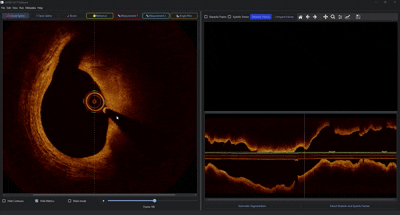
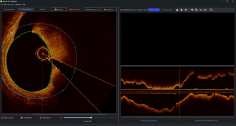
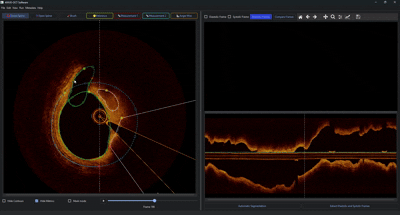

.. docs/contents/tutorial.rst

Tutorial
========

An example case is provided under ``/test_cases/patient_example``, allowing you to follow along.

v1.0.0 — Base module
---------------------

Window Manipulation
~~~~~~~~~~~~~~~~~~~

Hold :kbd:`RMB` to adjust windowing; press :kbd:`R` to reset.

.. image:: ../../media/explanation_software_part1.gif
   :alt: Window manipulation demo
   :align: center
   :width: 800px

Contour Manipulation
~~~~~~~~~~~~~~~~~~~~

1. Open the IVUS/OCT data file via **File → Open** or :kbd:`Ctrl+O`.
2. Click ``Automatic Segmentation`` to pre-segment the lumen in all frames (optional). Different ML models can be specified in ``config.yaml``.
3. Use :kbd:`A` and :kbd:`D` or :kbd:`MW` to navigate through frames (or use the slider below the image).
4. Press :kbd:`E` to draw a new contour by left-clicking to place points. Close the contour by clicking on the initial point. Drag existing points to adjust; click on the contour line to add new points.
5. Press :kbd:`Ctrl+Z` to undo the last action.

.. image:: ../../media/explanation_software_part2.gif
   :alt: Contour manipulation demo
   :align: center
   :width: 800px

Gating Module
~~~~~~~~~~~~~

Gating analyzes both image-derived metrics (pixel-wise correlation, blurriness) and vector-based contour measurements (distance and direction from the image center to each contour centroid) to identify diastolic and systolic frames.

Two curves are displayed:

- **Image-based curve (green):** Represents correlation peaks and minimal blurriness.
- **Contour-based curve (yellow):** Reflects extrema in the vector measurements (alternating peaks and valleys for systolic/diastolic positions).

A Butterworth filter (passband: 45-180 bpm) smooths each curve; the unfiltered signal is shown as a dotted line beneath.

**Interactive Gating Interface:**

- Click ``Gating`` to compute the gating signal. An automatic estimate for systolic and diastolic phases is set based on overlapping peaks.
- Specify the frame interval for gating and whether peaks should be treated as maxima or extrema.
- Zoom & Pan: zoom into the plot and drag marker lines to adjust thresholds, or remove unwanted markers by dragging them downward.
- Click ``Compare Frames`` to open the nearest proximal frame for the selected phase (systole or diastole).
- Press :kbd:`Alt+Delete` to delete all gating results and start over.
- Press :kbd:`Alt+P` to plot results for gated frames.

.. image:: ../../media/explanation_software_part3.gif
   :alt: Gating module demo
   :align: center
   :width: 800px

v1.1.x — Full Segmentation
----------------------------

Version 1.1.0 and higher add the ability to segment EEM, calcification, and side branches, following the same interaction style as for lumen contours. Clicking on any contour in the image automatically sets it as the active contour.

.. note::
   Segmentation models are currently only trained for lumen contours. Additional models for all contour types will be added in future versions.

v1.2.0 — OCT Support
----------------------

Since version 1.2.0, OCT images can be loaded and additional contouring functionalities are available.

**Example: Catheter angle and lumen/EEM contouring**

First, a catheter angle is added from the toolbar. Then a lumen contour is drawn as a closed spline, followed by an EEM contour. The EEM contour is given an uncertain region between a start point (yellow) and end point (red) by double-clicking. Zoom via mouse scroll is also demonstrated.

**Example: Open spline for calcium and side branch**

An open spline is created for a calcium contour (open splines automatically calculate the angle from the lumen center to the start and end points). Points are removed with :kbd:`RMB`. Using :kbd:`Ctrl+7` and selecting closed spline, a second calcium contour is drawn. Finally, a side branch contour is added.

**Example: Mask mode and hiding contours**

The display can switch between normal and mask mode (with pre-applied contour layering logic). Contours can also be hidden via the corresponding checkbox.

