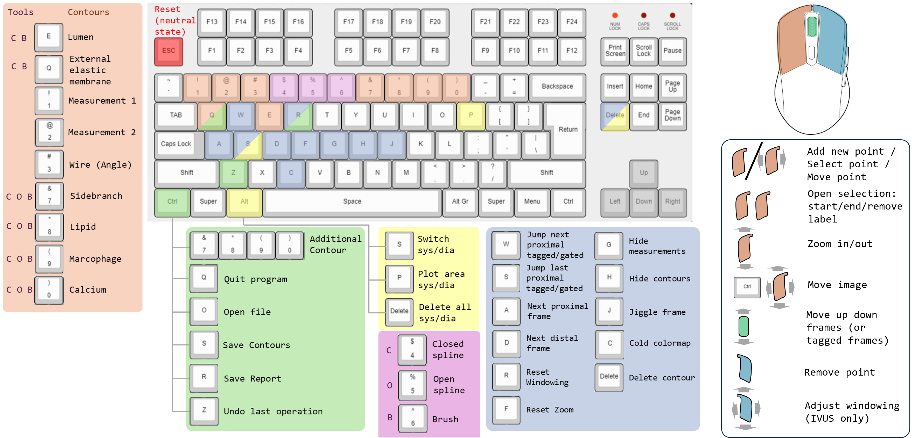

.. docs/contents/usage.rst

Usage
=====

After the config file is set up properly, run the application with:

.. code-block:: bash

   python3 src/main.py

This opens the graphical user interface (GUI) providing access to all functionalities described in :doc:`key_features`.

Keyboard Shortcuts
------------------

v1.0.0 (Base module)
~~~~~~~~~~~~~~~~~~~~~

- :kbd:`Ctrl+O` — Open a DICOM/NIfTI file
- :kbd:`A` / :kbd:`D` — Move through frames (previous/next)
- :kbd:`W` / :kbd:`S` — Move through gated (diastolic/systolic) frames (select phase via the corresponding button: blue = diastolic, red = systolic)
- :kbd:`E` — Draw a new lumen contour
- :kbd:`Ctrl+Z` — Undo (e.g. restore an accidentally deleted contour)
- :kbd:`1` / :kbd:`2` — Draw measurement 1 and 2, respectively
- :kbd:`RMB` (hold) — Windowing; :kbd:`R` to reset
- :kbd:`C` — Toggle color mode
- :kbd:`H` — Hide all contours
- :kbd:`J` — Jiggle around the current frame
- :kbd:`Ctrl+S` — Manually save contours (auto-save is enabled by default)
- :kbd:`Ctrl+R` — Generate report file
- :kbd:`Ctrl+Q` — Close the program
- :kbd:`Alt+P` — Plot results for gated frames (area difference systole/diastole by distance)
- :kbd:`Alt+Delete` — Define a range of frames to remove gating
- :kbd:`Alt+S` — Define a range of frames to switch systole and diastole in gated frames

v1.1.0 and higher
~~~~~~~~~~~~~~~~~~

Additional shortcuts available from version 1.1.0:

- :kbd:`Esc` — Exiting drawing mode (return to neutral state)
- :kbd:`RMB` on a knot point — Remove that point
- :kbd:`MW` (scroll) — Scroll through images
- :kbd:`LMB` (hold) — Zoom in/out current mouse position (reset with :kbd:`F`)
- :kbd:`Ctrl+LMB` — Move the image inside it's widget
- :kbd:`Q` — Draw an ``external elastic membrane`` (EEM) contour
- :kbd:`7` — Draw a ``calcification`` contour
- :kbd:`Ctrl+7` — Add an additional ``calcification`` contour in the current active spline tool (open or closed)
- :kbd:`8` — Draw a ``side branch`` contour
- :kbd:`Ctrl+8` — Add an additional ``side branch`` contour in the current active spline tool (open or closed)
- :kbd:`9` — Draw a ``lipid`` contour (open spline only)
- :kbd:`Ctrl+9` — Add an additional ``lipid`` contour
- :kbd:`0` — Draw a ``macrophage`` contour (open spline only)
- :kbd:`Ctrl+0` — Add an additional ``macrophage`` contour
- :kbd:`Ctrl+MW` — Shrink or expand the currently active contour; each scroll tick moves all knot points 1 pixel toward or away from their centroid
- :kbd:`Shift+Q` — Spawn an ``EEM`` contour from the existing ``lumen`` contour on the current frame (expands all knot points 20 % radially from the lumen centroid); does nothing if an EEM already exists on that frame
- :kbd:`Shift+A` — Copy the active contour from the previous frame to the current frame
- :kbd:`Shift+D` — Copy the active contour from the next frame to the current frame
- :kbd:`Shift+W` — Copy the active contour from the next gated/tagged frame (only active when the current frame is itself gated/tagged)
- :kbd:`Shift+S` — Copy the active contour from the previous gated/tagged frame (only active when the current frame is itself gated/tagged)
